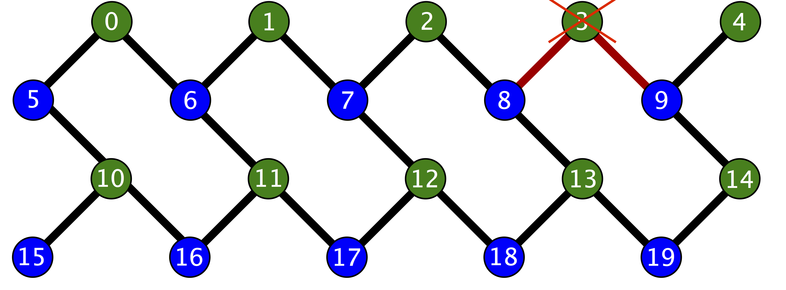

.. _compiler:

The Quil Compiler
=================

Expectations for Program Contents
---------------------------------

The QPUs have much more limited natural gate sets than the standard gate set offered by pyQuil: the
gate operators are constrained to lie in ``RZ(θ)``, ``RX(kπ/2)``, ``CZ``, and ``CPHASE(θ)``; and the
gates are required to act on physically available hardware (for single-qubit gates, this means
acting only on live qubits, and for qubit-pair gates, this means acting on neighboring qubits).

To ameliorate these limitations, the QPU execution stack contains an optimizing compiler that
translates arbitrary ProtoQuil to QPU-executable Quil.  The compiler is designed to avoid changing
even non-semantic details of input Quil code, except to make it shorter when possible.  For
instance, it will not readdress Quil code that is already appropriately addressed to physically
realizable hardware objects on the QPU.  The following figure illustrates the layout and addressing
of the Rigetti 19Q-Acorn QPU.

    Qubit adjacency schematic for the Rigetti 19Q-Acorn QPU.
    In particular, notice that qubit 3 is disabled.

Interacting with the Compiler
-----------------------------

The ``QVMConnection`` and ``QPUConnection`` classes in pyQuil offer indirect support for interacting
with the compiler: they are both capable of submitting jobs to the compiler for preprocessing before
the job is forwarded to the execution target.  This behavior is disabled by default for the QVM and
enabled by default for the QPU.  PyQuil also offers the ``CompilerConnection`` class for direct
access to the compiler, which returns compiled Program jobs to the user without executing them.
``CompilerConnection`` can be used to learn about the properties of the program,
like gate volume, single qubit gate depth, topological swaps, program fidelity and multiqubit gate
depth. In all cases, the user's Forest plan must have compiler access enabled to use these features.

Here’s an example of using ``CompilerConnection`` to compile a program that targets the 19Q-Acorn
QPU, separately from sending a program to the QPU/QVM.

.. code:: python

    from pyquil.api import CompilerConnection, get_devices
    from pyquil.quil import Pragma, Program
    from pyquil.gates import CNOT, H

    devices = get_devices(as_dict=True)
    acorn = devices['19Q-Acorn']
    compiler = CompilerConnection(acorn)

    job_id = compiler.compile_async(Program(H(0), CNOT(0,1), CNOT(1,2)))
    job = compiler.wait_for_job(job_id)

    print('compiled quil', job.compiled_quil())
    print('gate volume', job.gate_volume())
    print('gate depth', job.gate_depth())
    print('topological swaps', job.topological_swaps())
    print('program fidelity', job.program_fidelity())
    print('multiqubit gate depth', job.multiqubit_gate_depth())

Here's what you should see:

.. code:: python

    PRAGMA EXPECTED_REWIRING "#(6 1 7 3 4 5 0 2 8 9 10 11 12 13 14 15 16 17 18 19)"
    RZ(-pi/2) 1
    RX(pi/2) 1
    RZ(-pi/2) 6
    RX(-pi/2) 6
    CZ 1 6
    RX(-pi/2) 1
    RZ(-pi/2) 7
    RX(pi/2) 7
    CZ 7 1
    RZ(-pi/2) 1
    RZ(pi/2) 6
    RX(-pi/2) 7
    RZ(pi/2) 7
    PRAGMA CURRENT_REWIRING "#(6 1 7 3 4 5 0 2 8 9 10 11 12 13 14 15 16 17 18 19)"
    PRAGMA EXPECTED_REWIRING "#(6 1 7 3 4 5 0 2 8 9 10 11 12 13 14 15 16 17 18 19)"
    PRAGMA CURRENT_REWIRING "#(6 1 7 3 4 5 0 2 8 9 10 11 12 13 14 15 16 17 18 19)"

    gate volume 13
    gate depth 7
    topological swaps 0
    program fidelity 0.872503399848938
    multiqubit gate depth 2

The ``QVMConnection`` and ``QPUConnection`` objects have their compiler interactions set up in the
same way: the ``.run`` and ``.run_and_measure`` methods take the optional arguments
``needs_compilation`` and ``isa`` that respectively toggle the compilation preprocessing step and
provide the compiler with a target instruction set architecture, specified as a pyQuil ``ISA``
object. The compiler can be bypassed by passing the method parameter ``needs_compilation=False``.
If the ``isa`` named argument is not set, then the ``default_isa`` property on the
connection object is used instead. The compiled program can be accessed after a job has been
submitted to the QPU by using the ``.compiled_quil()`` accessor method on the resulting ``Job``
object instance.

Region-specific compiler features through PRAGMA
------------------------------------------------

The Quil compiler can also be communicated with through ``PRAGMA`` commands embedded in the Quil
program.

Preserved regions
~~~~~~~~~~~~~~~~~

The compiler can be circumvented in user-specified regions. The start of such a region is denoted by
``PRAGMA PRESERVE_BLOCK``, and the end is denoted by ``PRAGMA END_PRESERVE_BLOCK``.  The Quil
compiler promises not to modify any instructions contained in such a region.

The following is an example of a program that prepares a Bell state on qubits 0 and 1, then performs
a time delay to invite noisy system interaction before measuring the qubits.  The time delay region
is marked by ``PRAGMA PRESERVE_BLOCK`` and ``PRAGMA END_PRESERVE_BLOCK``; without these delimiters,
the compiler will remove the identity gates that serve to provide the time delay.  However, the
regions outside of the ``PRAGMA`` region will still be compiled, converting the Bell state preparation
to the native gate set.

.. code:: python

    #   prepare a Bell state
    H 0
    CNOT 0 1
    #   wait a while
    PRAGMA PRESERVE_BLOCK
    I 0
    I 1
    I 0
    I 1
    # ...
    I 0
    I 1
    PRAGMA END_PRESERVE_BLOCK
    #   and read out the results
    MEASURE 0 [0]
    MEASURE 1 [1]

Parallelizable regions
~~~~~~~~~~~~~~~~~~~~~~

The compiler can sometimes arrange gate sequences more cleverly if the user gives it hints about
sequences of gates that commute.  A region containing commuting sequences is bookended by
``PRAGMA COMMUTING_BLOCKS`` and ``PRAGMA END_COMMUTING_BLOCKS``; within such a region, a given
commuting sequence is bookended by ``PRAGMA BLOCK`` and ``PRAGMA END_BLOCK``.

The following snippet demonstrates this hinting syntax in a context typical of VQE-type algorithms:
after a first stage of performing some state preparation on individual qubits, there is a second
stage of "mixing operations" that both re-use qubit resources and mutually commute, followed by a
final rotation and measurement.  The following program is naturally laid out on a ring with vertices
(read either clockwise or counterclockwise) as 0, 1, 2, 3.  After scheduling the first round of
preparation gates, the compiler will use the hinting to schedule the first and third blocks (which
utilize qubit pairs 0-1 and 2-3) before the second and fourth blocks (which utilize qubit pairs 1-2
and 0-3), resulting in a reduction in circuit depth by one half.  Without hinting, the compiler will
instead execute the blocks in their written order.

.. code:: python

    # Stage one
    H 0
    H 1
    H 2
    H 3
    # Stage two
    PRAGMA COMMUTING_BLOCKS
    PRAGMA BLOCK
    CNOT 0 1
    RZ(0.4) 1
    CNOT 0 1
    PRAGMA END_BLOCK
    PRAGMA BLOCK
    CNOT 1 2
    RZ(0.6) 2
    CNOT 1 2
    PRAGMA END_BLOCK
    PRAGMA BLOCK
    CNOT 2 3
    RZ(0.8) 3
    CNOT 2 3
    PRAGMA END_BLOCK
    PRAGMA BLOCK
    CNOT 0 3
    RZ(0.9) 3
    CNOT 0 3
    PRAGMA END_BLOCK
    PRAGMA END_COMMUTING_BLOCKS
    # Stage three
    H 0
    H 1
    H 2
    H 3
    MEASURE 0 [0]
    MEASURE 1 [1]
    MEASURE 2 [2]
    MEASURE 3 [3]

Rewirings
~~~~~~~~~

When a Quil program contains multi-qubit instructions that do not name qubit-qubit links present on a
target device, the compiler will rearrange the qubits so that execution becomes possible.  In order to
help the user understand what rearrangement may have been done, the compiler emits two forms of
``PRAGMA``: ``PRAGMA EXPECTED_REWIRING`` and ``PRAGMA CURRENT_REWIRING``.  From the perspective of the
user, both ``PRAGMA`` instructions serve the same purpose: ``PRAGMA ..._REWIRING "#(n0 n1 ... nk)"``
indicates that the logical qubit labeled ``j`` in the program has been assigned to lie on the physical
qubit labeled ``nj`` on the device.  This is strictly for human-readability: user-supplied instructions
of the form ``PRAGMA ..._REWIRING`` are discarded and have no effect.

.. WARNING::

    The compiler **will not** rearrange qubits in programs which already map perfectly onto the
    target device, leaving it entirely up to the user to select high-fidelity configurations of
    qubits.

Common Error Messages
---------------------

The compiler itself is subject to some limitations, and some of the more commonly observed errors
follow:

+ ``! ! ! Error: Failed to select a SWAP instruction. Perhaps the qubit graph is disconnected?``
  This error indicates a readdressing failure: some non-native Quil could not be reassigned to lie
  on native devices.  Two common reasons for this failure are:

    + It is possible for the readdressing problem to be too difficult for the compiler to sort out,
      causing deadlock.
    + If a qubit-qubit gate is requested to act on two qubit resources that lie on disconnected
      regions of the qubit graph, the addresser will fail.

+ ``! ! ! Error: Matrices do not lie in the same projective class.`` The compiler attempted to
  decompose an operator as native Quil instructions, and the resulting instructions do not match the
  original operator.  This can happen when the original operator is not a unitary matrix, and could
  indicate an invalid ``DEFGATE`` block.
+ ``! ! ! Error: Addresser loop only supports pure quantum instructions.`` The compiler inspected an
  instruction that it does not understand.  The most common cause of this error is the inclusion of
  classical control in a program submission, which is legal Quil but falls outside of the
  domain of ProtoQuil.

