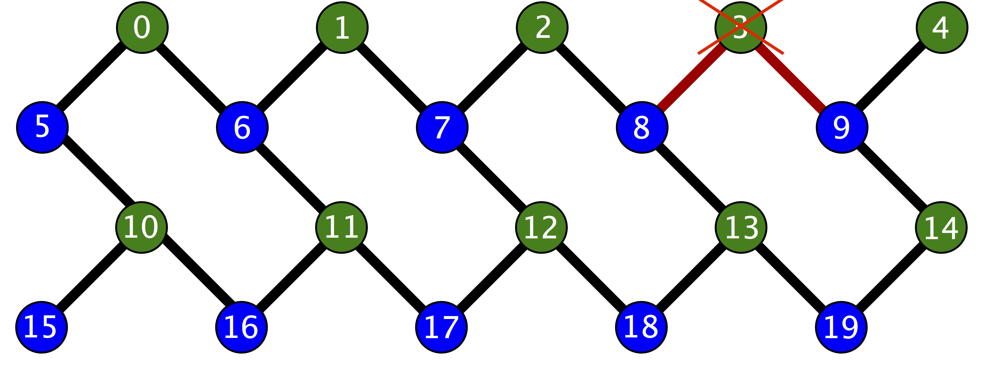

.. _compiler_usage:

Using quilc, the Quil compiler
==============================

The Quil compiler and expectations for program contents
-------------------------------------------------------

The QPUs have much more limited natural gate sets than the standard gate set offered by pyQuil: the
gate operators are constrained to lie in ``RZ(θ)``, ``RX(kπ/2)``, ``CZ``, and ``CPHASE(θ)``; and the gates are
required to act on physically available hardware (for single-qubit gates, this means acting only on
live qubits, and for qubit-pair gates, this means acting on neighboring qubits).

To ameliorate these limitations, the QPU execution stack contains an optimizing compiler that
translates arbitrary ProtoQuil to QPU-executable Quil.  The compiler is designed to avoid changing
even non-semantic details of input Quil code, except to make it shorter when possible.  For
instance, it will not readdress Quil code that is already appropriately addressed to physically
realizable hardware objects on the QPU.  The following figure illustrates the layout and addressing
of the Rigetti 19Q-Acorn QPU.

    Qubit adjacency schematic for the Rigetti 19Q-Acorn QPU. In particular, notice that qubits 3 and
    15 are disabled.

Interacting with the compiler
-----------------------------

The ``QVMConnection`` and ``QPUConnection`` classes in pyQuil offer indirect support for interacting with the compiler: they are both capable of submitting jobs to the compiler for preprocessing before the job is forwarded to the execution target.  This behavior is disabled by default for the QVM and enabled by default for the QPU.  pyQuil also offers the ``CompilerConnection`` class for direct access to the compiler, which returns compiled Program jobs to the user without executing them.  In all cases, the user's Forest plan must have compiler access enabled to use these features.

The ``QVMConnection`` and ``QPUConnection`` objects have their compiler interactions set up in the same way: the ``.run`` and ``.run_and_measure`` methods take the optional arguments ``needs_compilation`` and ``isa`` that respectively toggle the compilation preprocessing step and provide the compiler with a target instruction set architecture, specified as a pyQuil ``ISA`` object.  If the ``isa`` named argument is not set, then the ``default_isa`` property on the connection object is used instead.

The Quil compiler can also be communicated with through ``PRAGMA`` commands embedded in the Quil program.

    + It can be circumvented in user-specified regions. The start of such a region is denoted by ``PRAGMA PRESERVE_BLOCK``, and the end is denoted by ``PRAGMA END_PRESERVE_BLOCK``.  The Quil compiler promises not to modify any instructions contained in such a region.
    + It can sometimes arrange gate sequences more cleverly if the user gives it hints about sequences of gates that commute.  A region containing commuting sequences is bookended by ``PRAGMA COMMUTING_BLOCKS`` and ``PRAGMA END_COMMUTING_BLOCKS``; within such a region, a given commuting sequence is bookended by ``PRAGMA BLOCK`` and ``PRAGMA END_BLOCK``.  The following snippet demonstrates this hinting syntax:

.. code:: python

    PRAGMA COMMUTING_BLOCKS
    PRAGMA BLOCK
    CZ 0 1
    PRAGMA END_BLOCK
    PRAGMA BLOCK
    CZ 1 2
    PRAGMA END_BLOCK
    PRAGMA BLOCK
    CZ 0 2
    PRAGMA END_BLOCK
    PRAGMA END_COMMUTING_BLOCKS

Common error messages
---------------------

The compiler itself is subject to some limitations, and some of the more commonly observed errors
follow:

+ ``! ! ! Error: Failed to select a SWAP instruction. Perhaps the qubit graph is disconnected?``
  This error indicates a readdressing failure: some non-native Quil could not be reassigned to lie
  on native devices.  Two common reasons for this failure are:

    + It is possible for the readdressing problem to be too difficult for the compiler to sort out,
      causing deadlock.
    + If a qubit-qubit gate is requested to act on two qubit resources that lie on disconnected
      regions of the qubit graph, the addresser will fail.

+ ``! ! ! Error: Matrices do not lie in the same projective class.`` The compiler attempted to
  decompose an operator as native Quil instructions, and the resulting instructions do not match the
  original operator.  This can happen when the original operator is not a unitary matrix, and could
  indicate an invalid ``DEFGATE`` block.
+ ``! ! ! Error: Addresser loop only supports pure quantum instructions.`` The compiler inspected an
  instruction that it does not understand.  The most common cause of this error is the inclusion of
  classical control in a program submission (including the manual inclusion of ``MEASURE``
  instructions), which is legal Quil but falls outside of the domain of ProtoQuil.

