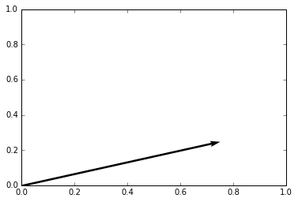
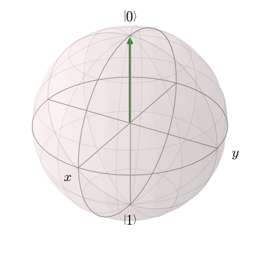
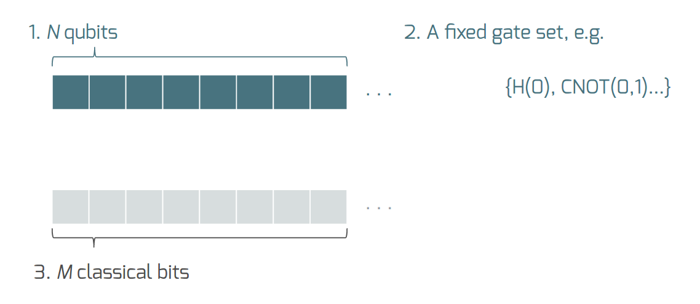
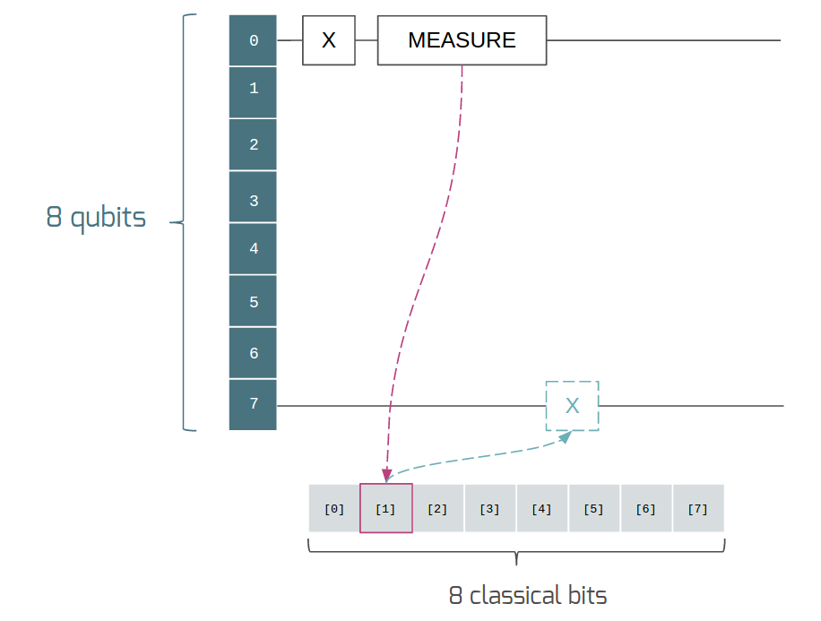
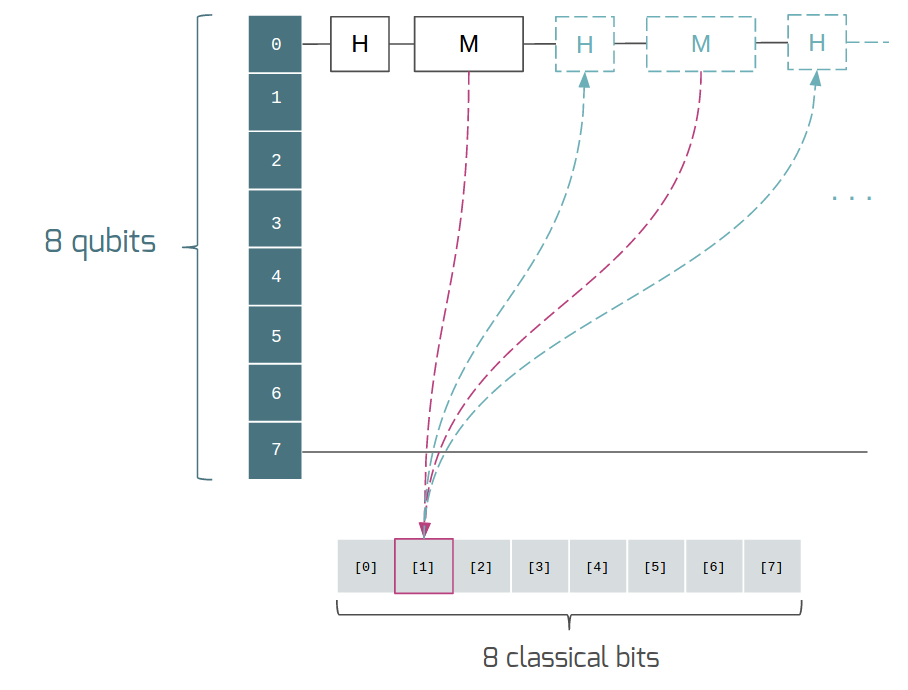

Introduction to Quantum Computing
=================================

With every breakthrough in science there is the potential for new
technology. For over twenty years, researchers have done inspiring work
in quantum mechanics, transforming it from a theory for understanding
nature into a fundamentally new way to engineer computing technology.
This field, quantum computing, is beautifully interdisciplinary,
and impactful in two major ways:

1. It reorients the relationship between physics and computer science.
   Physics does not just place restrictions on what computers we can
   design, it also grants new power and inspiration.

2. It can simulate nature at its most fundamental level, allowing us to
   solve deep problems in quantum chemistry, materials discovery, and more.

Quantum computing has come a long way, and in the next few years there
will be significant breakthroughs in the field. To get here, however,
we have needed to change our intuition for computation in many ways. As with
other paradigms --- such as object-oriented programming, functional programming,
distributed programming, or any of the other marvelous ways of thinking that have
been expressed in code over the years --- even the basic tenants of quantum computing
opens up vast new potential for computation.

However, unlike other paradigms, quantum computing goes further. It requires an extension
of classical probability theory. This extension, and the core of quantum
computing, can be formulated in terms of linear algebra. Therefore, we begin
our investigation into quantum computing with linear algebra and probability.

From Bit to Qubit
-----------------

Probabilistic Bits as Vector Spaces
^^^^^^^^^^^^^^^^^^^^^^^^^^^^^^^^^^^

From an operational perspective, a bit is described by the results of
measurements performed on it. Let the possible results of measuring a bit (0
or 1) be represented by orthonormal basis vectors \\(\\vec{0}\\) and
\\(\\vec{1}\\). We will call these vectors **outcomes**. These outcomes
span a two-dimensional vector space that represents a probabilistic bit.
A probabilistic bit can be represented as a vector

.. math::  \vec{v} = a\,\vec{0} + b\,\vec{1},

where \\(a\\) represents the probability of the bit being 0 and \\(b\\)
represents the probability of the bit being 1. This clearly also
requires that \\(a+b=1\\). In this picture the **system** (the
probabilistic bit) is a two-dimensional real vector space and a
**state** of a system is a particular vector in that vector space.

.. code:: python

    import numpy as np
    import matplotlib.pyplot as plt

    outcome_0 = np.array([1.0, 0.0])
    outcome_1 = np.array([0.0, 1.0])
    a = 0.75
    b = 0.25

    prob_bit = a*outcome_0 + b*outcome_1

    X,Y = prob_bit
    plt.figure()
    ax = plt.gca()
    ax.quiver(X,Y,angles='xy',scale_units='xy',scale=1)
    ax.set_xlim([0,1])
    ax.set_ylim([0,1])
    plt.draw()
    plt.show()

Given some state vector, like the one plotted above, we can find the
probabilities associated with each outcome by projecting the vector onto
the basis outcomes. This gives us the following rule:

.. math::  \operatorname{Pr}(0) = \vec{v}^T.\vec{0} = a \\ \operatorname{Pr}(1) = \vec{v}^T.\vec{1} = b,

where Pr(0) and Pr(1) are the probabilities of the 0 and 1 outcomes
respectively.

Dirac Notation
^^^^^^^^^^^^^^

Physicists have introduced a convenient notation for the vector transposes and dot
products we used in the previous example. This notation, called Dirac notation in honor
of the great theoretical physicist Paul Dirac, allows us to define

.. math::  \vec{v} = |\,v\rangle \\ \vec{v}^T = \langle v\,| \\ \vec{u}^T.\vec{v} = \langle u\,|\,v \rangle.

Thus, we can rewrite our "measurement rule" in this notation as

.. math::  Pr(0) = \langle v\,|\,0 \rangle = a \\ Pr(1) = \langle v\,|\,1 \rangle = b.

We will use this notation throughout the rest of this introduction.

Multiple Probabilistic Bits
^^^^^^^^^^^^^^^^^^^^^^^^^^^

This vector space interpretation of a single probabilistic bit can be
straightforwardly extended to multiple bits. Let us take two coins as an
example (labelled 0 and 1 instead of H and T since we are
programmers). Their states can be represented as

.. math::

    |\,u\rangle = \frac{1}{2}|\,0_u\rangle + \frac{1}{2}|\,1_u\rangle \\
   |\,v\rangle = \frac{1}{2}|\,0_v\rangle + \frac{1}{2}|\,1_v\rangle,

where \\(1\_u\\) represents the 1 outcome on coin \\(u\\). The
**combined system** of the two coins has four possible outcomes \\(\\{
0\_u0\_v,\\;0\_u1\_v,\\;1\_u0\_v,\\;1\_u1\_v \\}\\) that are the basis
states of a larger four-dimensional vector space. The rule for
constructing a **combined state** is to take the tensor product of
individual states, e.g.

.. math::  |\,u\rangle\otimes|\,v\rangle = \frac{1}{4}|\,0_u0_v\rangle+\frac{1}{4}|\,0_u1_v\rangle+\frac{1}{4}|\,1_u0_v\rangle+\frac{1}{4}|\,1_u1_v\rangle.

Then, the combined space is simply the space spanned by the tensor products
of all pairs of basis vectors of the two smaller spaces.

We will talk more about these larger spaces in the quantum case, but it is
important to note that not all composite states can be written as tensor
products of sub-states. (Consider the state \\(\\frac{1}{2}|\\,0\_u0\_v\\rangle + \\frac{1}{2}|\\,1\_u1\_v\\rangle\\).) In general, the combined state for \\(n\\)
probabilistic bits is a vector of size \\(2^n\\) and is given by
\\(\\bigotimes\_{i=0}^{n-1}\|\\,v\_i\\rangle\\).

Qubits
^^^^^^

Quantum mechanics rewrites these rules to some extent. A quantum bit, called a
qubit, is the quantum analog of a bit in that it has two outcomes when
it is measured. Similar to the previous section, a qubit can also be
represented in a vector space, but with complex coefficients instead of
real ones. A qubit **system** is a two-dimensional complex vector space,
and the **state** of a qubit is a complex vector in that space. Again we
will define a basis of outcomes \\(\\{\|\\,0\\rangle,
\|\\,1\\rangle\\}\\) and let a generic qubit state be written as

.. math:: \alpha |\,0\rangle + \beta |\,1\rangle.

Since these coefficients can be imaginary, they cannot be simply
interpreted as probabilities of their associated outcomes. Instead we
rewrite the rule for outcomes in the following manner:

.. math::  \operatorname{Pr}(0) = |\langle v\,|\,0 \rangle|^2 = |\alpha|^2 \\ \operatorname{Pr}(1) = |\langle v\,|\,1 \rangle|^2 = |\beta|^2,

and as long as \\(\|\\alpha\|^2 + \|\\beta\|^2 = 1\\) we are able to
recover acceptable probabilities for outcomes based on our new complex
vector.

This switch to complex vectors means that rather than representing a
state vector in a plane, we instead to represent the vector on a
sphere (called the Bloch sphere in quantum mechanics literature).
From this perspective the quantum state corresponding to an
outcome of 0 is represented by:

Notice that the two axes in the horizontal plane have been labeled \\(x\\)
and \\(y\\), implying that \\(z\\) is the vertical axis (not labeled). Physicists
use the convention that a qubit's \\(\\{\|\\,0\\rangle,
\|\\,1\\rangle\\}\\) states are the
positive and negative unit vectors along the z axis, respectively. These
axes will be useful later in this document.

Multiple qubits are represented in precisely the same way, but taking
tensor products of the spaces and states. Thus \\(n\\) qubits have
\\(2^n\\) possible states.

An Important Distinction
^^^^^^^^^^^^^^^^^^^^^^^^

An important distinction between the probabilistic case described above
and the quantum case is that probabilistic states may just mask out
ignorance. For example a coin is physically only 0 or 1 and the
probabilistic view merely represents our ignorance about which it actually
is. **This is not the case in quantum mechanics**. Assuming events cannot instantaneously
influence one another, the quantum states ---
as far as we know --- cannot mask any underlying state. This is what
people mean when they say that there is no `local hidden variable theory
<https://en.wikipedia.org/wiki/Bell's_theorem>`_ for
quantum mechanics. These probabilistic quantum states are as real as it
gets: they don't describe our knowledge of the quantum system, they
describe the physical reality of the system.

Some Code
^^^^^^^^^

Let us take a look at some code in pyQuil to see how these quantum states
play out. We will dive deeper into quantum operations and pyQuil in
the following sections. Note that in order to run these examples you will need
to `install pyQuil and set up a connection to the Forest API <getting_started.html#getting-started>`_.
Each of the code snippets below will be immediately followed by its output.

.. code:: python

    # Imports for pyQuil (ignore for now)
    import numpy as np
    from pyquil.quil import Program
    from pyquil.api import QVMConnection
    quantum_simulator = QVMConnection()

    # pyQuil is based around operations (or gates) so we will start with the most
    # basic one: the identity operation, called I. I takes one argument, the index
    # of the qubit that it should be applied to.
    from pyquil.gates import I

    # Make a quantum program that allocates one qubit (qubit #0) and does nothing to it
    p = Program(I(0))

    # Quantum states are called wavefunctions for historical reasons.
    # We can run this basic program on our connection to the simulator.
    # This call will return the state of our qubits after we run program p.
    # This api call returns a tuple, but we'll ignore the second value for now.
    wavefunction = quantum_simulator.wavefunction(p)

    # wavefunction is a Wavefunction object that stores a quantum state as a list of amplitudes
    alpha, beta = wavefunction

    print("Our qubit is in the state alpha={} and beta={}".format(alpha, beta))
    print("The probability of measuring the qubit in outcome 0 is {}".format(abs(alpha)**2))
    print("The probability of measuring the qubit in outcome 1 is {}".format(abs(beta)**2))

.. parsed-literal::

    Our qubit is in the state alpha=(1+0j) and beta=0j
    The probability of measuring the qubit in outcome 0 is 1.0
    The probability of measuring the qubit in outcome 1 is 0.0

Applying an operation to our qubit affects the probability of each outcome.

.. code:: python

    # We can import the qubit "flip" operation, called X, and see what it does.
    # We will learn more about this operation in the next section.
    from pyquil.gates import X

    p = Program(X(0))

    wavefunc = quantum_simulator.wavefunction(p)
    alpha, beta = wavefunc

    print("Our qubit is in the state alpha={} and beta={}".format(alpha, beta))
    print("The probability of measuring the qubit in outcome 0 is {}".format(abs(alpha)**2))
    print("The probability of measuring the qubit in outcome 1 is {}".format(abs(beta)**2))

.. parsed-literal::

    Our qubit is in the state alpha=0j and beta=(1+0j)
    The probability of measuring the qubit in outcome 0 is 0.0
    The probability of measuring the qubit in outcome 1 is 1.0

In this case we have flipped the probability of outcome 0 into the probability of outcome 1 for our qubit.
We can also investigate what happens to the state of multiple qubits. We'd expect the state of
multiple qubits to grow exponentially in size, as their vectors are tensored together.

.. code:: python

    # Multiple qubits also produce the expected scaling of the state.
    p = Program(I(0), I(1))
    wavefunction = quantum_simulator.wavefunction(p)
    print("The quantum state is of dimension:", len(wavefunction.amplitudes))

    p = Program(I(0), I(1), I(2), I(3))
    wavefunction = quantum_simulator.wavefunction(p)
    print("The quantum state is of dimension:", len(wavefunction.amplitudes))

    p = Program()
    for x in range(10):
        p.inst(I(x))
    wavefunction = quantum_simulator.wavefunction(p)
    print("The quantum state is of dimension:", len(wavefunction.amplitudes)  )

.. parsed-literal::

    The quantum state is of dimension: 4
    The quantum state is of dimension: 16
    The quantum state is of dimension: 1024

Let's look at the actual value for the state of two qubits combined. The
resulting dictionary of this method contains outcomes as keys and the probabilities of
those outcomes as values.

.. code:: python

    # wavefunction(Program) returns a coefficient array that corresponds to outcomes in the following order
    wavefunction = quantum_simulator.wavefunction(Program(I(0), I(1)))
    print(wavefunction.get_outcome_probs())

.. parsed-literal::

    {'00': 1.0, '01': 0.0, '10': 0.0, '11': 0.0}

Qubit Operations
----------------

In the previous section we introduced our first two **operations**: the ``I``
(or identity) operation and the ``X`` operation. In this section we will get into some
more details on what these operations are.

Quantum states are complex vectors on the Bloch sphere, and quantum operations are matrices with two properties:

1. They are reversible.
2. When applied to a state vector on the Bloch sphere, the resulting vector
   is also on the Bloch sphere.

Matrices that satisfy these two properties are called unitary matrices. Applying an operation to a quantum state is the same as multiplying a vector by one of these matrices. Such an operation is called a **gate**.

Since individual qubits are two-dimensional vectors, operations on
individual qubits are 2x2 matrices. The identity matrix leaves the state vector unchanged:

.. math::

   I = \left(\begin{matrix}
   1 & 0\\
   0 & 1
   \end{matrix}\right)

so the program that applies this operation to the zero state is just

.. math::

    I\,|\,0\rangle = \left(\begin{matrix}
   1 & 0\\
   0 & 1
   \end{matrix}\right)\left(\begin{matrix}
   1 \\
   0
   \end{matrix}\right) = \left(\begin{matrix}
   1 \\
   0
   \end{matrix}\right) = |\,0\rangle

.. code:: python

    p = Program(I(0))
    print(quantum_simulator.wavefunction(p))

.. parsed-literal::

    (1+0j)|0>

Pauli Operators
^^^^^^^^^^^^^^^

Let's revisit the ``X`` gate introduced above. It is one of three important single-qubit gates,
called the Pauli operators:

.. math::

   X = \left(\begin{matrix}
   0 & 1\\
   1 & 0
   \end{matrix}\right)
   \qquad
   Y = \left(\begin{matrix}
   0 & -i\\
   i & 0
   \end{matrix}\right)
   \qquad
   Z = \left(\begin{matrix}
   1 & 0\\
   0 & -1
   \end{matrix}\right)

.. code:: python

    from pyquil.gates import X, Y, Z

    p = Program(X(0))
    wavefunction = quantum_simulator.wavefunction(p)
    print("X|0> = ", wavefunction)
    print("The outcome probabilities are", wavefunction.get_outcome_probs())
    print("This looks like a bit flip.\n")

    p = Program(Y(0))
    wavefunction = quantum_simulator.wavefunction(p)
    print("Y|0> = ", wavefunction)
    print("The outcome probabilities are", wavefunction.get_outcome_probs())
    print("This also looks like a bit flip.\n")

    p = Program(Z(0))
    wavefunction = quantum_simulator.wavefunction(p)
    print("Z|0> = ", wavefunction)
    print("The outcome probabilities are", wavefunction.get_outcome_probs())
    print("This state looks unchanged.")

.. parsed-literal::

    X|0> =  (1+0j)|1>
    The outcome probabilities are {'1': 1.0, '0': 0.0}
    This looks like a bit flip.

    Y|0> =  1j|1>
    The outcome probabilities are {'1': 1.0, '0': 0.0}
    This also looks like a bit flip.

    Z|0> =  (1+0j)|0>
    The outcome probabilities are {'1': 0.0, '0': 1.0}
    This state looks unchanged.

The Pauli matrices have a visual interpretation: they perform 180-degree rotations of
qubit state vectors on the Bloch sphere. They operate about their respective axes
as shown in the Bloch sphere depicted above. For example, the ``X`` gate performs a 180-degree
rotation **about** the \\(x\\) axis. This explains the results of our code above: for a state vector
initially in the +\\(z\\) direction, both ``X`` and ``Y`` gates will rotate it to -\\(z\\),
and the ``Z`` gate will leave it unchanged.

However, notice that while the ``X`` and ``Y`` gates produce the same outcome probabilities, they
actually produce different states. These states are not distinguished if they are measured
immediately, but they produce different results in larger programs.

Quantum programs are built by applying successive gate operations:

.. code:: python

    # Composing qubit operations is the same as multiplying matrices sequentially
    p = Program(X(0), Y(0), Z(0))
    wavefunction = quantum_simulator.wavefunction(p)

    print("ZYX|0> = ", wavefunction)
    print("With outcome probabilities\n", wavefunction.get_outcome_probs())

.. parsed-literal::

    ZYX|0> =  [ 0.-1.j  0.+0.j]
    With outcome probabilities
    {'0': 1.0, '1': 0.0}

Multi-Qubit Operations
^^^^^^^^^^^^^^^^^^^^^^

Operations can also be applied to composite states of multiple qubits.
One common example is the controlled-NOT or ``CNOT`` gate that works on two
qubits. Its matrix form is:

.. math::

   CNOT = \left(\begin{matrix}
   1 & 0 & 0 & 0 \\
   0 & 1 & 0 & 0 \\
   0 & 0 & 0 & 1 \\
   0 & 0 & 1 & 0 \\
   \end{matrix}\right)

Let's take a look at how we could use a ``CNOT`` gate in pyQuil.

.. code:: python

    from pyquil.gates import CNOT

    p = Program(CNOT(0, 1))
    wavefunction = quantum_simulator.wavefunction(p)
    print("CNOT|00> = ", wavefunction)
    print("With outcome probabilities\n", wavefunction.get_outcome_probs())

    p = Program(X(0), CNOT(0, 1))
    wavefunction = quantum_simulator.wavefunction(p)
    print("CNOT|01> = ", wavefunction)
    print("With outcome probabilities\n", wavefunction.get_outcome_probs())

    p = Program(X(1), CNOT(0, 1))
    wavefunction = quantum_simulator.wavefunction(p)
    print("CNOT|10> = ", wavefunction)
    print("With outcome probabilities\n", wavefunction.get_outcome_probs())

    p = Program(X(0), X(1), CNOT(0, 1))
    wavefunction = quantum_simulator.wavefunction(p)
    print("CNOT|11> = ", wavefunction)
    print("With outcome probabilities\n", wavefunction.get_outcome_probs())

.. parsed-literal::

    CNOT|00> =  (1+0j)|00>
    With outcome probabilities
     {'00': 1.0, '01': 0.0, '10': 0.0, '11': 0.0}

    CNOT|01> =  (1+0j)|11>
    With outcome probabilities
     {'00': 0.0, '01': 0.0, '10': 0.0, '11': 1.0}

    CNOT|10> =  (1+0j)|10>
    With outcome probabilities
     {'00': 0.0, '01': 0.0, '10': 1.0, '11': 0.0}

    CNOT|11> =  (1+0j)|01>
    With outcome probabilities
     {'00': 0.0, '01': 1.0, '10': 0.0, '11': 0.0}

The ``CNOT`` gate does what its name implies: the state of the second qubit is flipped
(negated) if and only if the state of the first qubit is 1 (true).

Another two-qubit gate example is the ``SWAP`` gate, which swaps the \\( \|01\\rangle \\)
and \\(\|10\\rangle \\) states:

.. math::

   SWAP = \left(\begin{matrix}
   1 & 0 & 0 & 0 \\
   0 & 0 & 1 & 0 \\
   0 & 1 & 0 & 0 \\
   0 & 0 & 0 & 1 \\
   \end{matrix}\right)

.. code:: python

    from pyquil.gates import SWAP
    p = Program(X(0), SWAP(0,1))
    wavefunction = quantum_simulator.wavefunction(p)

    print("SWAP|01> = ", wavefunction)
    print("With outcome probabilities\n", wavefunction.get_outcome_probs())

.. parsed-literal::

    SWAP|01> =  (1+0j)|10>
    With outcome probabilities
     {'00': 0.0, '01': 0.0, '10': 1.0, '11': 0.0}

In summary, quantum computing operations are composed of a series of
complex matrices applied to complex vectors. These matrices must be unitary (meaning that
their complex conjugate transpose is equal to their inverse) because the overall probability of
all outcomes must always sum to one.

The Quantum Abstract Machine
----------------------------

We now have enough background to introduce the programming model
that underlies Quil. This is a hybrid quantum-classical model in which
\\(N\\) qubits interact with \\(M\\) classical bits:

These qubits and classical bits come with a defined gate set, e.g. which
gate operations can be applied to which qubits. Different kinds of
quantum computing hardware place different limitations on what gates
can be applied, and the fixed gate set represents these limitations.

Full details on the Quantum Abstract Machine and Quil can be found in the
Quil `whitepaper <https://arxiv.org/abs/1608.03355>`_.

The next section on measurements will describe the interaction between
the classical and quantum parts of a Quantum Abstract Machine (QAM).

Qubit Measurements
^^^^^^^^^^^^^^^^^^

Measurements have two effects:

#. They project the state vector onto one of the basic outcomes
#. (*optional*) They store the outcome
   of the measurement in a classical bit.

Here's a simple example:

.. code:: python

    # Create a program that stores the outcome of measuring qubit #0 into classical register [0]
    classical_register_index = 0
    p = Program(I(0)).measure(0, classical_register_index)

Up until this point we have used the quantum simulator to cheat a little bit --- we have
actually looked at the wavefunction that comes back. However, on real
quantum hardware, we are unable to directly look at the wavefunction.
Instead we only have access to the classical bits that are affected by
measurements. This functionality is emulated by the ``run`` command.

.. code:: python

    # Choose which classical registers to look in at the end of the computation
    classical_regs = [0, 1]
    print(quantum_simulator.run(p, classical_regs))

.. parsed-literal::

    [[0, 0]]

We see that both registers are zero. However, if we had flipped the
qubit before measurement then we obtain:

.. code:: python

    classical_register_index = 0
    p = Program(X(0)) # Flip the qubit
    p.measure(0, classical_register_index) # Measure the qubit

    classical_regs = [0, 1]
    print(quantum_simulator.run(p, classical_regs))

.. parsed-literal::

    [[1, 0]]

These measurements are deterministic, e.g. if we make them multiple
times then we always get the same outcome:

.. code:: python

    classical_register_index = 0
    p = Program(X(0)) # Flip the qubit
    p.measure(0, classical_register_index) # Measure the qubit

    classical_regs = [0]
    trials = 10
    print(quantum_simulator.run(p, classical_regs, trials))

.. parsed-literal::

    [[1], [1], [1], [1], [1], [1], [1], [1], [1], [1]]

Classical/Quantum Interaction
^^^^^^^^^^^^^^^^^^^^^^^^^^^^^

However this is not the case in general --- measurements can affect the quantum
state as well. In fact, measurements act like projections onto
the outcome basis states. To show how this works, we first introduce a new single-qubit gate,
the Hadamard gate. The matrix form of the Hadamard gate is:

.. math::

   H = \frac{1}{\sqrt{2}}\left(\begin{matrix}
   1 & 1\\
   1 & -1
   \end{matrix}\right)

The following pyQuil code shows how we can use the Hadamard gate:

.. code:: python

    from pyquil.gates import H

    # The Hadamard produces what is called a superposition state
    coin_program = Program(H(0))
    wavefunction = quantum_simulator.wavefunction(coin_program)

    print("H|0> = ", wavefunction)
    print("With outcome probabilities\n", wavefunction.get_outcome_probs())

.. parsed-literal::

    H|0> =  (0.7071067812+0j)|0> + (0.7071067812+0j)|1>
    With outcome probabilities
    {'0': 0.49999999999999989, '1': 0.49999999999999989}

A qubit in this state will be measured half of the time in the \\( \|0\\rangle \\) state,
and half of the time in the \\( \|1\\rangle \\) state. In a sense, this qubit truly is a
random variable representing a
coin. In fact, there are many wavefunctions that will give this same operational
outcome. There is a continuous family of states of the form

.. math::

   \frac{1}{\sqrt{2}}\left(|\,0\rangle + e^{i\theta}|\,1\rangle\right)

that represent the outcomes of an unbiased coin.  Being able to work with
all of these different new states is part of what gives quantum computing
extra power over regular bits.

.. code:: python

    # Introduce measurement
    classical_reg = 0
    coin_program = Program(H(0)).measure(0, classical_reg)
    trials = 10

    # We see probabilistic results of about half 1's and half 0's
    print(quantum_simulator.run(coin_program, [0], trials))

.. parsed-literal::

    [[0], [1], [1], [0], [1], [0], [0], [1], [0], [0]]

pyQuil allows us to look at the wavefunction **after** a measurement as well:

.. code:: python

    classical_reg = 0
    coin_program = Program(H(0))
    print("Before measurement: H|0> = ", quantum_simulator.wavefunction(coin_program))

    coin_program.measure(0, classical_reg)
    for x in range(5):
        print("After measurement: ", quantum_simulator.wavefunction(coin_program))

.. parsed-literal::

    Before measurement: H|0> =  [ 0.70710678+0.j  0.70710678+0.j]

    After measurement:  (1+0j)|1>
    After measurement:  (1+0j)|0>
    After measurement:  (1+0j)|0>
    After measurement:  (1+0j)|1>
    After measurement:  (1+0j)|1>

We can clearly see that measurement has an effect on the quantum state
independent of what is stored classically. We begin in a state that has
a 50-50 probability of being \\( \|0\\rangle \\) or \\( \|1\\rangle \\).
After measurement, the state changes into being entirely in \\( \|0\\rangle \\)
or entirely in \\( \|1\\rangle \\) according to which outcome was
obtained. This is the phenomenon referred to as the **collapse** of the wavefunction.
Mathematically, the wavefunction is being projected onto the vector of
the obtained outcome and subsequently rescaled to unit norm.

.. code:: python

    # This happens with bigger systems too
    classical_reg = 0

    # This program prepares something called a Bell state (a special kind of "entangled state")
    bell_program = Program(H(0), CNOT(0, 1))
    wavefunction = quantum_simulator.wavefunction(bell_program)
    print("Before measurement: H|0> = ", wavefunction)

    bell_program.measure(0, classical_reg)
    for x in range(5):
        wavefunction = quantum_simulator.wavefunction(bell_program)
        print("After measurement: ", wavefunction.get_outcome_probs())

.. parsed-literal::

    Before measurement: H|0> =  (0.7071067812+0j)|00> + (0.7071067812+0j)|11>

    After measurement:  {'00': 1.0, '01': 0.0, '10': 0.0, '11': 0.0}
    After measurement:  {'00': 0.0, '01': 0.0, '10': 0.0, '11': 1.0}
    After measurement:  {'00': 1.0, '01': 0.0, '10': 0.0, '11': 0.0}
    After measurement:  {'00': 1.0, '01': 0.0, '10': 0.0, '11': 0.0}
    After measurement:  {'00': 0.0, '01': 0.0, '10': 0.0, '11': 1.0}

The above program prepares **entanglement** because, even though there are
random outcomes, after every measurement both qubits are in the same state. They
are either both \\( \|0\\rangle \\) or both \\( \|1\\rangle \\). This special kind of
correlation is part of what makes quantum mechanics so unique and powerful.

Classical Control
^^^^^^^^^^^^^^^^^

There are also ways of introducing classical control of quantum
programs. For example, we can use the state of classical bits to determine what
quantum operations to run.

.. code:: python

    true_branch = Program(X(7)) # if branch
    false_branch = Program(I(7)) # else branch

    # Branch on classical reg [1]
    p = Program(X(0)).measure(0, 1).if_then(1, true_branch, false_branch)

    # Measure qubit #7 into classical register [7]
    p.measure(7, 7)

    # Run and check register [7]
    print(quantum_simulator.run(p, [7]))

.. parsed-literal::

    [[1]]

A [1] here means that qubit 7 was indeed flipped.

Example: The Probabilistic Halting Problem
^^^^^^^^^^^^^^^^^^^^^^^^^^^^^^^^^^^^^^^^^^

A fun example is to create a program that has an exponentially
increasing chance of halting, but that may run forever!

.. code:: python

    inside_loop = Program(H(0)).measure(0, 1)

    p = Program().inst(X(0)).while_do(1, inside_loop)

    # Run and check register [1]
    print(quantum_simulator.run(p, [1]))

.. parsed-literal::

    [[0]]

Next Steps
----------

We hope that you have enjoyed your whirlwind tour of quantum computing.
You are now ready to check out the `Installation and Getting Started <getting_started.html>`_ guide!

If you would like to learn more, Nielsen and Chuang's
*Quantum Computation and Quantum Information* is a particularly excellent resource for
newcomers to the field.

If you're interested in learning about the software behind quantum computing, take a look
at our blog posts on `The Quantum Software
Challenge <https://medium.com/@rigetticomputing/the-quantum-software-challenge-1a86eec1ce47>`_.
