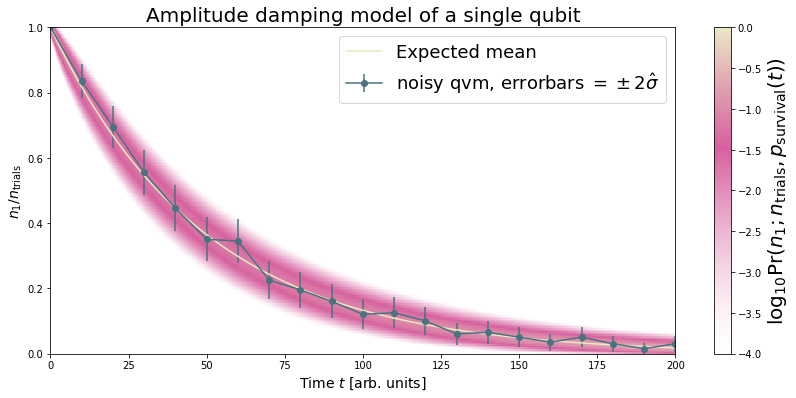
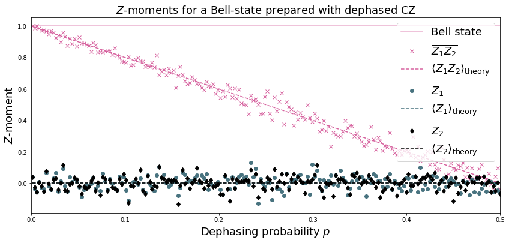
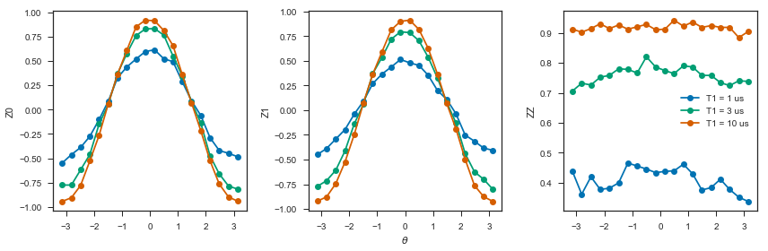
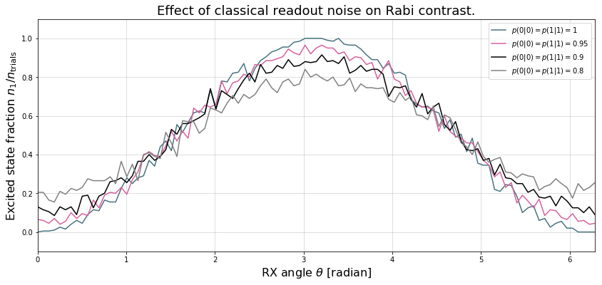
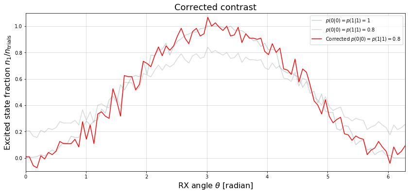

.. _noise:

Noise and Quantum Computation
=============================

Modeling Noisy Quantum Gates
----------------------------

.. begin import from GateNoiseModels.ipynb

Pure States vs. Mixed States
~~~~~~~~~~~~~~~~~~~~~~~~~~~~

Errors in quantum computing can introduce classical uncertainty in what the underlying state is. When this happens we
sometimes need to consider not only wavefunctions but also probabilistic sums of wavefunctions when we are uncertain as
to which one we have. For example, if we think that an X gate was accidentally applied to a qubit with a 50-50 chance
then we would say that there is a 50% chance we have the :math:`\ket{0}` state and a 50% chance that we have a
:math:`\ket{1}` state. This is called an "impure" or "mixed"state in that it isn't just a wavefunction (which is pure)
but instead a distribution over wavefunctions. We describe this with something called a density matrix, which is
generally an operator. Pure states have very simple density matrices that we can write as an outer product of a ket
vector :math:`\ket{\psi}` with its own bra version :math:`\bra{\psi}=\ket{\psi}^\dagger`. For a pure state the density
matrix is simply

.. math::

   \rho_\psi = \ket{\psi}\bra{\psi}.

The expectation value of an operator for a mixed state is given by

.. math::

   \langle X \rangle_\rho = \tr{X \rho}

where :math:`\tr{\cdot}` is the trace of an operator, which is the sum of its diagonal elements, which is independent of
choice of basis. Pure state density matrices satisfy

.. math::

   \rho \text{ is pure } \Leftrightarrow \rho^2 = \rho

which you can easily verify for :math:`\rho_\psi` assuming that the state is normalized. If we want to describe a
situation with classical uncertainty between states :math:`\rho_1` and :math:`\rho_2`, then we can take their weighted sum

.. math::

   \rho = p \rho_1 + (1-p) \rho_2

where :math:`p\in [0,1]` gives the classical probability that the state is :math:`\rho_1`.

Note that classical uncertainty in the wavefunction is markedly different from superpositions. We can represent
superpositions using wavefunctions, but use density matrices to describe distributions over wavefunctions. You can read
more about density matrices here [DensityMatrix]_.

.. [DensityMatrix] https://en.wikipedia.org/wiki/Density_matrix

Quantum Gate Errors
~~~~~~~~~~~~~~~~~~~

For a quantum gate given by its unitary operator :math:`U`, a "quantum gate error" describes the scenario in which the
actually induced transformation deviates from :math:`\ket{\psi} \mapsto U\ket{\psi}`. There are two basic types of
quantum gate errors:

1. **coherent errors** are those that preserve the purity of the input
   state, i.e., instead of the above mapping we carry out a perturbed,
   but unitary operation :math:`\ket{\psi} \mapsto \tilde{U}\ket{\psi}`,
   where :math:`\tilde{U} \neq U`.
2. **incoherent errors** are those that do not preserve the purity of
   the input state, in this case we must actually represent the
   evolution in terms of density matrices. The state
   :math:`\rho := \ket{\psi}\bra{\psi}` is then mapped as

   .. math::

      \rho \mapsto \sum_{j=1}^m K_j\rho K_j^\dagger,

   where the operators :math:`\{K_1, K_2, \dots, K_m\}` are called
   Kraus operators and must obey
   :math:`\sum_{j=1}^m K_j^\dagger K_j = I` to conserve the trace of
   :math:`\rho`. Maps expressed in the above form are called Kraus maps.
   It can be shown that every physical map on a finite dimensional
   quantum system can be represented as a Kraus map, though this
   representation is not generally unique. `You can find more
   information about quantum operations
   here <https://en.wikipedia.org/wiki/Quantum_operation#Kraus_operators>`__

In a way, coherent errors are *in principle* amendable by more precisely
calibrated control. Incoherent errors are more tricky.

Why Do Incoherent Errors Happen?
~~~~~~~~~~~~~~~~~~~~~~~~~~~~~~~~

When a quantum system (e.g., the qubits on a quantum processor) is not
perfectly isolated from its environment it generally co-evolves with the
degrees of freedom it couples to. The implication is that while the
total time evolution of system and environment can be assumed to be
unitary, restriction to the system state generally is not.

**Let's throw some math at this for clarity:** Let our total Hilbert
space be given by the tensor product of system and environment Hilbert
spaces: :math:`\mathcal{H} = \mathcal{H}_S \otimes \mathcal{H}_E`. Our
system "not being perfectly isolated" must be translated to the
statement that the global Hamiltonian contains a contribution that
couples the system and environment:

.. math::

   H = H_S \otimes I + I \otimes H_E + V

where :math:`V` non-trivally acts on both the system and the
environment. Consequently, even if we started in an initial state that
factorized over system and environment
:math:`\ket{\psi}_{S,0}\otimes \ket{\psi}_{E,0}` if everything evolves
by the Schrödinger equation

.. math::

   \ket{\psi_t} = e^{-i \frac{Ht}{\hbar}} \left(\ket{\psi}_{S,0}\otimes \ket{\psi}_{E,0}\right)

the final state will generally not admit such a factorization.

A Toy Model
~~~~~~~~~~~

**In this (somewhat technical) section we show how environment
interaction can corrupt an identity gate and derive its Kraus map.** For
simplicity, let us assume that we are in a reference frame in which both
the system and environment Hamiltonian's vanish :math:`H_S = 0, H_E = 0`
and where the cross-coupling is small even when multiplied by the
duration of the time evolution
:math:`\|\frac{tV}{\hbar}\|^2 \sim \epsilon \ll 1` (any operator norm
:math:`\|\cdot\|` will do here). Let us further assume that
:math:`V = \sqrt{\epsilon} V_S \otimes V_E` (the more general case is
given by a sum of such terms) and that the initial environment state
satisfies :math:`\bra{\psi}_{E,0} V_E\ket{\psi}_{E,0} = 0`. This turns
out to be a very reasonable assumption in practice but a more thorough
discussion exceeds our scope.

Then the joint system + environment state
:math:`\rho = \rho_{S,0} \otimes \rho_{E,0}` (now written as a density
matrix) evolves as

.. math::

   \rho \mapsto \rho' :=  e^{-i \frac{Vt}{\hbar}} \rho e^{+i \frac{Vt}{\hbar}}

Using the Baker-Campbell-Hausdorff theorem we can expand this to second
order in :math:`\epsilon`

.. math::

   \rho' = \rho - \frac{it}{\hbar} [V, \rho] - \frac{t^2}{2\hbar^2} [V, [V, \rho]] + O(\epsilon^{3/2})

We can insert the initially factorizable state
:math:`\rho = \rho_{S,0} \otimes \rho_{E,0}` and trace over the
environmental degrees of freedom to obtain

.. math::

   \begin{align}
   \rho_S' := \tr{\rho'}_E & = \rho_{S,0}  \underbrace{\tr{\rho_{E,0}}_{1}} - \frac{i\sqrt{\epsilon} t}{\hbar} \underbrace{\left[ V_S \rho_{S,0} \underbrace{\tr{V_E\rho_{E,0}}}_{\bra{\psi}_{E,0} V_E\ket{\psi}_{E,0} = 0} - \rho_{S,0}V_S  \underbrace{\tr{\rho_{E,0}V_E}}_{\bra{\psi}_{E,0} V_E\ket{\psi}_{E,0} = 0} \right]}_0 \\
   & - \frac{\epsilon t^2}{2\hbar^2} \left[ V_S^2\rho_{S,0}\tr{V_E^2 \rho_{E,0}} + \rho_{S,0} V_S^2 \tr{\rho_{E,0}V_E^2} - 2 V_S\rho_{S,0}V_S\tr{V_E \rho_{E,0}V_E}\right] \\
   & = \rho_{S,0} - \frac{\gamma}{2} \left[ V_S^2\rho_{S,0} + \rho_{S,0} V_S^2  - 2 V_S\rho_{S,0}V_S\right]
   \end{align}

where the coefficient in front of the second part is by our initial
assumption very small
:math:`\gamma := \frac{\epsilon t^2}{2\hbar^2}\tr{V_E^2 \rho_{E,0}} \ll 1`.
This evolution happens to be approximately equal to a Kraus map with
operators
:math:`K_1 := I - \frac{\gamma}{2} V_S^2, K_2:= \sqrt{\gamma} V_S`:

.. math::

   \begin{align}
   \rho_S \to \rho_S' &= K_1\rho K_1^\dagger + K_2\rho K_2^\dagger
    = \rho - \frac{\gamma}{2}\left[ V_S^2 \rho + \rho V_S^2\right] + \gamma V_S\rho_S V_S + O(\gamma^2)
   \end{align}

This agrees to :math:`O(\epsilon^{3/2})` with the result of our
derivation above. This type of derivation can be extended to many other
cases with little complication and a very similar argument is used to
derive the `Lindblad master
equation <https://en.wikipedia.org/wiki/Lindblad_equation>`__.

Noisy Gates on the Rigetti QVM
------------------------------

As of today, users of our Forest SDK can annotate their Quil programs by
certain pragma statements that inform the QVM that a particular gate on
specific target qubits should be replaced by an imperfect realization
given by a Kraus map.

The QVM propagates **pure states** --- so how does it simulate noisy gates?
It does so by yielding the correct outcomes **in the average over many
executions of the Quil program**: When the noisy version of a gate
should be applied the QVM makes a random choice which Kraus operator is
applied to the current state with a probability that ensures that the
average over many executions is equivalent to the Kraus map. In
particular, a particular Kraus operator :math:`K_j` is applied to
:math:`\ket{\psi}_S`

.. math::

   \ket{\psi'}_S = \frac{1}{\sqrt{p_j}} K_j \ket{\psi}_S

with probability
:math:`p_j:= \bra{\psi}_S K_j^\dagger K_j \ket{\psi}_S`. In the average
over many execution :math:`N \gg 1` we therefore find that

.. math::

   \begin{align}
   \overline{\rho_S'} & = \frac{1}{N} \sum_{n=1}^N \ket{\psi'_n}_S\bra{\psi'_n}_S \\
   & = \frac{1}{N} \sum_{n=1}^N p_{j_n}^{-1}K_{j_n}\ket{\psi'}_S \bra{\psi'}_SK_{j_n}^\dagger
   \end{align}

where :math:`j_n` is the chosen Kraus operator label in the :math:`n`-th
trial. This is clearly a Kraus map itself! And we can group identical
terms and rewrite it as

.. math::

   \begin{align}
   \overline{\rho_S'} & =
     \sum_{\ell=1}^n \frac{N_\ell}{N}  p_{\ell}^{-1}K_{\ell}\ket{\psi'}_S \bra{\psi'}_SK_{\ell}^\dagger
   \end{align}

where :math:`N_{\ell}` is the number of times that Kraus operator label
:math:`\ell` was selected. For large enough :math:`N` we know that
:math:`N_{\ell} \approx N p_\ell` and therefore

.. math::

   \begin{align}
   \overline{\rho_S'} \approx \sum_{\ell=1}^n K_{\ell}\ket{\psi'}_S \bra{\psi'}_SK_{\ell}^\dagger
   \end{align}

which proves our claim. **The consequence is that noisy gate simulations
must generally be repeated many times to obtain representative
results**.

Getting Started
~~~~~~~~~~~~~~~

1. Come up with a good model for your noise. We will provide some
   examples below and may add more such examples to our public
   repositories over time. Alternatively, you can characterize the gate
   under consideration using `Quantum Process
   Tomography <https://arxiv.org/abs/1202.5344>`__ or `Gate Set
   Tomography <http://www.pygsti.info/>`__ and use the resulting process
   matrices to obtain a very accurate noise model for a particular QPU.
2. Define your Kraus operators as a list of numpy arrays
   ``kraus_ops = [K1, K2, ..., Km]``.
3. For your Quil program ``p``, call:

   ::

       p.define_noisy_gate("MY_NOISY_GATE", [q1, q2], kraus_ops)

   where you should replace ``MY_NOISY_GATE`` with the gate of interest
   and ``q1, q2`` with the indices of the qubits.

**Scroll down for some examples!**

.. code:: python

    import numpy as np
    import matplotlib.pyplot as plt
    from scipy.stats import binom
    import matplotlib.colors as colors
    %matplotlib inline

.. code:: python

    from pyquil import Program, get_qc
    from pyquil.gates import CZ, H, I, X, MEASURE
    from scipy.linalg import expm

.. code:: python

    # We could ask for "2q-noisy-qvm" but we will be specifying
    # our noise model as PRAGMAs on the Program itself.
    qc = get_qc('2q-qvm')

Example 1: Amplitude Damping
~~~~~~~~~~~~~~~~~~~~~~~~~~~~

Amplitude damping channels are imperfect identity maps with Kraus
operators

.. math::

   K_1 = \begin{pmatrix}
   1 & 0 \\
   0 & \sqrt{1-p}
   \end{pmatrix} \\
   K_2 = \begin{pmatrix}
   0 & \sqrt{p} \\
   0 & 0
   \end{pmatrix}

where :math:`p` is the probability that a qubit in the :math:`\ket{1}`
state decays to the :math:`\ket{0}` state.

.. code:: python

    def damping_channel(damp_prob=.1):
        """
        Generate the Kraus operators corresponding to an amplitude damping
        noise channel.

        :params float damp_prob: The one-step damping probability.
        :return: A list [k1, k2] of the Kraus operators that parametrize the map.
        :rtype: list
        """
        damping_op = np.sqrt(damp_prob) * np.array([[0, 1],
                                                    [0, 0]])

        residual_kraus = np.diag([1, np.sqrt(1-damp_prob)])
        return [residual_kraus, damping_op]

    def append_kraus_to_gate(kraus_ops, g):
        """
        Follow a gate `g` by a Kraus map described by `kraus_ops`.

        :param list kraus_ops: The Kraus operators.
        :param numpy.ndarray g: The unitary gate.
        :return: A list of transformed Kraus operators.
        """
        return [kj.dot(g) for kj in kraus_ops]

    def append_damping_to_gate(gate, damp_prob=.1):
        """
        Generate the Kraus operators corresponding to a given unitary
        single qubit gate followed by an amplitude damping noise channel.

        :params np.ndarray|list gate: The 2x2 unitary gate matrix.
        :params float damp_prob: The one-step damping probability.
        :return: A list [k1, k2] of the Kraus operators that parametrize the map.
        :rtype: list
        """
        return append_kraus_to_gate(damping_channel(damp_prob), gate)

.. code:: python

    %%time

    # single step damping probability
    damping_per_I = 0.02

    # number of program executions
    trials = 200

    results_damping = []
    lengths = np.arange(0, 201, 10, dtype=int)
    for jj, num_I in enumerate(lengths):
        print("\r{}/{}, ".format(jj, len(lengths)), end="")

        p = Program(X(0))
        # want increasing number of I-gates
        p.inst([I(0) for _ in range(num_I)])
        p.inst(MEASURE(0, 0))

        # overload identity I on qc 0
        p.define_noisy_gate("I", [0], append_damping_to_gate(np.eye(2), damping_per_I))
        p.wrap_in_numshots_loop(trials)
        qc.qam.random_seed = int(num_I)
        res = qc.run(p)
        results_damping.append([np.mean(res), np.std(res) / np.sqrt(trials)])

    results_damping = np.array(results_damping)

.. code:: python

    dense_lengths = np.arange(0, lengths.max()+1, .2)
    survival_probs = (1-damping_per_I)**dense_lengths
    logpmf = binom.logpmf(np.arange(trials+1)[np.newaxis, :], trials, survival_probs[:, np.newaxis])/np.log(10)

.. code:: python

    DARK_TEAL = '#48737F'
    FUSCHIA = "#D6619E"
    BEIGE = '#EAE8C6'
    cm = colors.LinearSegmentedColormap.from_list('anglemap', ["white", FUSCHIA, BEIGE], N=256, gamma=1.5)

.. code:: python

    plt.figure(figsize=(14, 6))
    plt.pcolor(dense_lengths, np.arange(trials+1)/trials, logpmf.T, cmap=cm, vmin=-4, vmax=logpmf.max())
    plt.plot(dense_lengths, survival_probs, c=BEIGE, label="Expected mean")
    plt.errorbar(lengths, results_damping[:,0], yerr=2*results_damping[:,1], c=DARK_TEAL,
                 label=r"noisy qvm, errorbars $ = \pm 2\hat{\sigma}$", marker="o")
    cb = plt.colorbar()
    cb.set_label(r"$\log_{10} \mathrm{Pr}(n_1; n_{\rm trials}, p_{\rm survival}(t))$", size=20)

    plt.title("Amplitude damping model of a single qubit", size=20)
    plt.xlabel(r"Time $t$ [arb. units]", size=14)
    plt.ylabel(r"$n_1/n_{\rm trials}$", size=14)
    plt.legend(loc="best", fontsize=18)
    plt.xlim(*lengths[[0, -1]])
    plt.ylim(0, 1)

Example 2: Dephased CZ-gate
~~~~~~~~~~~~~~~~~~~~~~~~~~~

Dephasing is usually characterized through a qubit's :math:`T_2` time.
For a single qubit the dephasing Kraus operators are

.. math::

   K_1(p) = \sqrt{1-p} I_2 \\
   K_2(p) = \sqrt{p} \sigma_Z

where :math:`p = (1 - \exp(-T_{\rm gate}/T_2))/2` is the probability that
the qubit is dephased over the time interval of interest, :math:`I_2` is
the :math:`2\times 2`-identity matrix and :math:`\sigma_Z` is the
Pauli-Z operator.

For two qubits, we must construct a Kraus map that has *four* different
outcomes:

1. No dephasing
2. Qubit 1 dephases
3. Qubit 2 dephases
4. Both dephase

The Kraus operators for this are given by

.. math::

   \begin{align}
   K'_1(p,q) = K_1(p)\otimes K_1(q) \\
   K'_2(p,q) = K_2(p)\otimes K_1(q) \\
   K'_3(p,q) = K_1(p)\otimes K_2(q) \\
   K'_4(p,q) = K_2(p)\otimes K_2(q)
   \end{align}

where we assumed a dephasing probability :math:`p` for the first qubit
and :math:`q` for the second.

Dephasing is a *diagonal* error channel and the CZ gate is also
diagonal, therefore we can get the combined map of dephasing and the CZ
gate simply by composing :math:`U_{\rm CZ}` the unitary representation
of CZ with each Kraus operator

.. math::

   \begin{align}
   K^{\rm CZ}_1(p,q) = K_1(p)\otimes K_1(q)U_{\rm CZ} \\
   K^{\rm CZ}_2(p,q) = K_2(p)\otimes K_1(q)U_{\rm CZ} \\
   K^{\rm CZ}_3(p,q) = K_1(p)\otimes K_2(q)U_{\rm CZ} \\
   K^{\rm CZ}_4(p,q) = K_2(p)\otimes K_2(q)U_{\rm CZ}
   \end{align}

**Note that this is not always accurate, because a CZ gate is often
achieved through non-diagonal interaction Hamiltonians! However, for
sufficiently small dephasing probabilities it should always provide a
good starting point.**

.. code:: python

    def dephasing_kraus_map(p=.1):
        """
        Generate the Kraus operators corresponding to a dephasing channel.

        :params float p: The one-step dephasing probability.
        :return: A list [k1, k2] of the Kraus operators that parametrize the map.
        :rtype: list
        """
        return [np.sqrt(1-p)*np.eye(2), np.sqrt(p)*np.diag([1, -1])]

    def tensor_kraus_maps(k1, k2):
        """
        Generate the Kraus map corresponding to the composition
        of two maps on different qubits.

        :param list k1: The Kraus operators for the first qubit.
        :param list k2: The Kraus operators for the second qubit.
        :return: A list of tensored Kraus operators.
        """
        return [np.kron(k1j, k2l) for k1j in k1 for k2l in k2]

.. code:: python

    %%time
    # single step damping probabilities
    ps = np.linspace(.001, .5, 200)

    # number of program executions
    trials = 500

    results = []

    for jj, p in enumerate(ps):

        corrupted_CZ = append_kraus_to_gate(
        tensor_kraus_maps(
            dephasing_kraus_map(p),
            dephasing_kraus_map(p)
        ),
        np.diag([1, 1, 1, -1]))

        print("\r{}/{}, ".format(jj, len(ps)), end="")

        # make Bell-state
        p = Program(H(0), H(1), CZ(0,1), H(1))

        p.inst(MEASURE(0, 0))
        p.inst(MEASURE(1, 1))

        # overload CZ on qc 0
        p.define_noisy_gate("CZ", [0, 1], corrupted_CZ)
        p.wrap_in_numshots_loop(trials)
        qc.qam.random_seed = jj
        res = qc.run(p)
        results.append(res)

    results = np.array(results)

.. code:: python

    Z1s = (2*results[:,:,0]-1.)
    Z2s = (2*results[:,:,1]-1.)
    Z1Z2s = Z1s * Z2s

    Z1m = np.mean(Z1s, axis=1)
    Z2m = np.mean(Z2s, axis=1)
    Z1Z2m = np.mean(Z1Z2s, axis=1)

.. code:: python

    plt.figure(figsize=(14, 6))
    plt.axhline(y=1.0, color=FUSCHIA, alpha=.5, label="Bell state")

    plt.plot(ps, Z1Z2m, "x", c=FUSCHIA, label=r"$\overline{Z_1 Z_2}$")
    plt.plot(ps, 1-2*ps, "--", c=FUSCHIA, label=r"$\langle Z_1 Z_2\rangle_{\rm theory}$")

    plt.plot(ps, Z1m, "o", c=DARK_TEAL, label=r"$\overline{Z}_1$")
    plt.plot(ps, 0*ps, "--", c=DARK_TEAL, label=r"$\langle Z_1\rangle_{\rm theory}$")

    plt.plot(ps, Z2m, "d", c="k", label=r"$\overline{Z}_2$")
    plt.plot(ps, 0*ps, "--", c="k", label=r"$\langle Z_2\rangle_{\rm theory}$")

    plt.xlabel(r"Dephasing probability $p$", size=18)
    plt.ylabel(r"$Z$-moment", size=18)
    plt.title(r"$Z$-moments for a Bell-state prepared with dephased CZ", size=18)
    plt.xlim(0, .5)
    plt.legend(fontsize=18)

.. end import from GateNoiseModel.ipynb

Adding Decoherence Noise
------------------------

In this example, we investigate how a program might behave on a
near-term device that is subject to *T1*- and *T2*-type noise using the convenience function
:py:func:`pyquil.noise.add_decoherence_noise`. The same module also contains some other useful
functions to define your own types of noise models, e.g.,
:py:func:`pyquil.noise.tensor_kraus_maps` for generating multi-qubit noise processes,
:py:func:`pyquil.noise.combine_kraus_maps` for describing the succession of two noise processes and
:py:func:`pyquil.noise.append_kraus_to_gate` which allows appending a noise process to a unitary
gate.

.. code:: python

    from pyquil.quil import Program
    from pyquil.paulis import PauliSum, PauliTerm, exponentiate, exponential_map, trotterize
    from pyquil.gates import MEASURE, H, Z, RX, RZ, CZ
    import numpy as np

The Task
~~~~~~~~

We want to prepare :math:`e^{i \theta XY}` and measure it in the
:math:`Z` basis.

.. code:: python

    from numpy import pi
    theta = pi/3
    xy = PauliTerm('X', 0) * PauliTerm('Y', 1)

The Idiomatic PyQuil Program
~~~~~~~~~~~~~~~~~~~~~~~~~~~~

.. code:: python

    prog = exponential_map(xy)(theta)
    print(prog)

.. parsed-literal::

    H 0
    RX(pi/2) 1
    CNOT 0 1
    RZ(2*pi/3) 1
    CNOT 0 1
    H 0
    RX(-pi/2) 1

The Compiled Program
~~~~~~~~~~~~~~~~~~~~

To run on a real device, we must compile each program to the native gate
set for the device. The high-level noise model is similarly constrained
to use a small, native gate set. In particular, we can use

-  :math:`I`
-  :math:`RZ(\theta)`
-  :math:`RX(\pm \pi/2)`
-  :math:`CZ`

For simplicity, the compiled program is given below but generally you
will want to use a compiler to do this step for you.

.. code:: python

    def get_compiled_prog(theta):
        return Program([
            RZ(-pi/2, 0),
            RX(-pi/2, 0),
            RZ(-pi/2, 1),
            RX( pi/2, 1),
            CZ(1, 0),
            RZ(-pi/2, 1),
            RX(-pi/2, 1),
            RZ(theta, 1),
            RX( pi/2, 1),
            CZ(1, 0),
            RX( pi/2, 0),
            RZ( pi/2, 0),
            RZ(-pi/2, 1),
            RX( pi/2, 1),
            RZ(-pi/2, 1),
        ])

Scan Over Noise Parameters
~~~~~~~~~~~~~~~~~~~~~~~~~~

We perform a scan over three levels of noise, each at 20 theta points.

Specifically, we investigate T1 values of 1, 3, and 10 us. By default,
T2 = T1 / 2, 1 qubit gates take 50 ns, and 2 qubit gates take 150 ns.

In alignment with the device, :math:`I` and parametric :math:`RZ` are
noiseless while :math:`RX` and :math:`CZ` gates experience 1q and 2q
gate noise, respectively.

.. code:: python

    from pyquil.api import QVMConnection
    cxn = QVMConnection()

.. code:: python

    t1s = np.logspace(-6, -5, num=3)
    thetas = np.linspace(-pi, pi, num=20)
    t1s * 1e6 # us

.. parsed-literal::

    array([  1.        ,   3.16227766,  10.        ])

.. code:: python

    from pyquil.noise import add_decoherence_noise
    records = []
    for theta in thetas:
        for t1 in t1s:
            prog = get_compiled_prog(theta)
            noisy = add_decoherence_noise(prog, T1=t1).inst([
                MEASURE(0, 0),
                MEASURE(1, 1),
            ])
            bitstrings = np.array(cxn.run(noisy, [0,1], 1000))

            # Expectation of Z0 and Z1
            z0, z1 = 1 - 2*np.mean(bitstrings, axis=0)

            # Expectation of ZZ by computing the parity of each pair
            zz = 1 - (np.sum(bitstrings, axis=1) % 2).mean() * 2

            record = {
                'z0': z0,
                'z1': z1,
                'zz': zz,
                'theta': theta,
                't1': t1,
            }
            records += [record]

Plot the Results
~~~~~~~~~~~~~~~~

Note that to run the code below you will need to install the `pandas` and `seaborn` packages.

.. code:: python

    %matplotlib inline
    from matplotlib import pyplot as plt
    import seaborn as sns
    sns.set(style='ticks', palette='colorblind')

.. code:: python

    import pandas as pd
    df_all = pd.DataFrame(records)
    fig, (ax1, ax2, ax3) = plt.subplots(1, 3, figsize=(12,4))

    for t1 in t1s:
        df = df_all.query('t1 == @t1')

        ax1.plot(df['theta'], df['z0'], 'o-')
        ax2.plot(df['theta'], df['z1'], 'o-')
        ax3.plot(df['theta'], df['zz'], 'o-', label='T1 = {:.0f} us'.format(t1*1e6))

    ax3.legend(loc='best')

    ax1.set_ylabel('Z0')
    ax2.set_ylabel('Z1')
    ax3.set_ylabel('ZZ')
    ax2.set_xlabel(r'$\theta$')
    fig.tight_layout()

Modeling Readout Noise
----------------------

Qubit-Readout can be corrupted in a variety of ways. The two most
relevant error mechanisms on the Rigetti QPU right now are:

1. Transmission line noise that makes a 0-state look like a 1-state or
   vice versa. We call this **classical readout bit-flip error**. This
   type of readout noise can be reduced by tailoring optimal readout
   pulses and using superconducting, quantum limited amplifiers to
   amplify the readout signal before it is corrupted by classical noise
   at the higher temperature stages of our cryostats.
2. T1 qubit decay during readout (our readout operations can take more
   than a µsecond unless they have been specially optimized), which
   leads to readout signals that initially behave like 1-states but then
   collapse to something resembling a 0-state. We will call this
   **T1-readout error**. This type of readout error can be reduced by
   achieving shorter readout pulses relative to the T1 time, i.e., one
   can try to reduce the readout pulse length, or increase the T1 time
   or both.

Qubit Measurements
~~~~~~~~~~~~~~~~~~

This section provides the necessary theoretical foundation for
accurately modeling noisy quantum measurements on superconducting
quantum processors. It relies on some of the abstractions (density
matrices, Kraus maps) introduced in our notebook on `gate noise
models <https://github.com/rigetti/forest-tutorials/blob/master/notebooks/GateNoiseModels.ipynb>`__.

The most general type of measurement performed on a single qubit at a
single time can be characterized by some set :math:`\mathcal{O}` of
measurement outcomes, e.g., in the simplest case
:math:`\mathcal{O} = \{0, 1\}`, and some unnormalized quantum channels
(see notebook on gate noise models) that encapsulate: 1. the probability
of that outcome, and 2. how the qubit state is affected conditional on
the measurement outcome.

Here the *outcome* is understood as classical information that has been
extracted from the quantum system.

Projective, Ideal Measurement
_____________________________

The simplest case that is usually taught in introductory quantum
mechanics and quantum information courses are Born's rule and the
projection postulate which state that there exist a complete set of
orthogonal projection operators

.. math::

   P_{\mathcal{O}} := \{\Pi_x \text{ Projector }\mid x \in \mathcal{O}\},

i.e., one for each measurement outcome. Any projection operator must
satisfy :math:`\Pi_x^\dagger = \Pi_x = \Pi_x^2` and for an *orthogonal*
set of projectors any two members satisfy

.. math::

   \Pi_x\Pi_y = \delta_{xy} \Pi_x = \begin{cases} 0 & \text{ if } x \ne y \\ \Pi_x & \text{ if } x = y \end{cases}

and for a *complete* set we additionally demand that
:math:`\sum_{x\in\mathcal{O}} \Pi_x = 1`. Following our introduction to
gate noise, we write quantum states as density matrices, as this is more
general and in closer correspondence with classical probability theory.

With these, the probability of outcome :math:`x` is given by
:math:`p(x) = \tr{\Pi_x \rho \Pi_x} = \tr{\Pi_x^2 \rho} = \tr{\Pi_x \rho}`
and the post measurement state is

.. math::

   \rho_x = \frac{1}{p(x)} \Pi_x \rho \Pi_x,

which is the projection postulate applied to mixed states.

If we were a sloppy quantum programmer and accidentally erased the
measurement outcome, then our best guess for the post measurement
state would be given by something that looks an awful lot like a Kraus
map:

.. math::

   \rho_{\text{post measurement}} = \sum_{x\in\mathcal{O}} p(x) \rho_x = \sum_{x\in\mathcal{O}} \Pi_x \rho \Pi_x.

The completeness of the projector set ensures that the trace of the
post measurement is still 1 and the Kraus map form of this expression
ensures that :math:`\rho_{\text{post measurement}}` is a positive
(semi-)definite operator.

Classical Readout Bit-Flip Error
________________________________

Consider now the ideal measurement as above, but where the outcome
:math:`x` is transmitted across a noisy classical channel that produces
a final outcome :math:`x'\in \mathcal{O}' = \{0', 1'\}` according to
some conditional probabilities :math:`p(x'|x)` that can be recorded in
the *assignment probability matrix*

.. math::

   P_{x'|x} = \begin{pmatrix}
   p(0 | 0) & p(0 | 1) \\
   p(1 | 0) & p(1 | 1)
   \end{pmatrix}

Note that this matrix has only two independent parameters as each
column must be a valid probability distribution, i.e. all elements are
non-negative and each column sums to 1.

This matrix allows us to obtain the probabilities
:math:`\mathbf{p}' := (p(x'=0), p(x'=1))^T` from the original outcome
probabilities :math:`\mathbf{p} := (p(x=0), p(x=1))^T` via
:math:`\mathbf{p}' = P_{x'|x}\mathbf{p}`. The difference relative to the
ideal case above is that now an outcome :math:`x' = 0` does not
necessarily imply that the post measurement state is truly
:math:`\Pi_{0} \rho \Pi_{0} / p(x=0)`. Instead, the post measurement
state given a noisy outcome :math:`x'` must be

.. math::

   \begin{aligned}
   \rho_{x'} & = \sum_{x\in \mathcal{O}} p(x|x') \rho_x \\
             & = \sum_{x\in \mathcal{O}} p(x'|x)\frac{p(x)}{p(x')} \rho_x \\
             & = \frac{1}{p(x')}\sum_{x\in \mathcal{O}} p(x'|x) \Pi_x \rho \Pi_x
   \end{aligned}

where

.. math::

   \begin{aligned}
   p(x') & = \sum_{x\in\mathcal{O}} p(x'|x) p(x)  \\
   & = \tr{\sum_{x\in \mathcal{O}} p(x'|x) \Pi_x \rho \Pi_x} \\
   & = \tr{\rho \sum_{x\in \mathcal{O}} p(x'|x)\Pi_x} \\
   & = \tr{\rho E_{x'}}.
   \end{aligned}

where we have exploited the cyclical property of the trace
:math:`\tr{ABC}=\tr{BCA}` and the projection property
:math:`\Pi_x^2 = \Pi_x`. This has allowed us to derive the noisy outcome
probabilities from a set of positive operators

.. math::

   E_{x'} := \sum_{x\in \mathcal{O}} p(x'|x)\Pi_x \ge 0

that must sum to 1:

.. math::

   \sum_{x'\in\mathcal{O}'} E_{x'} = \sum_{x\in\mathcal{O}}\underbrace{\left[\sum_{x'\in\mathcal{O}'} p(x'|x)\right]}_{1}\Pi_x = \sum_{x\in\mathcal{O}}\Pi_x = 1.

The above result is a type of generalized **Bayes' theorem** that is
extremely useful for this type of (slightly) generalized measurement and
the family of operators :math:`\{E_{x'}| x' \in \mathcal{O}'\}` whose
expectations given the probabilities is called a **positive operator
valued measure** (POVM). These operators are not generally orthogonal
nor valid projection operators, but they naturally arise in this
scenario. This is not yet the most general type of measurement, but it
will get us pretty far.

How to Model :math:`T_1` Error
______________________________

T1 type errors fall outside our framework so far as they involve a
scenario in which the *quantum state itself* is corrupted during the
measurement process in a way that potentially erases the pre-measurement
information as opposed to a loss of purely classical information. The
most appropriate framework for describing this is given by that of
measurement instruments, but for the practical purpose of arriving at a
relatively simple description, we propose describing this by a T1
damping Kraus map followed by the noisy readout process as described
above.

Further Reading
_______________

Chapter 3 of John Preskill's lecture notes
http://www.theory.caltech.edu/people/preskill/ph229/notes/chap3.pdf

Working with Readout Noise
--------------------------

1. Come up with a good guess for your readout noise parameters
   :math:`p(0|0)` and :math:`p(1|1)`; the off-diagonals then follow from
   the normalization of :math:`P_{x'|x}`. If your assignment fidelity
   :math:`F` is given, and you assume that the classical bit flip noise
   is roughly symmetric, then a good approximation is to set
   :math:`p(0|0)=p(1|1)=F`.
2. For your Quil program ``p`` and a qubit index ``q`` call:

   ::

       p.define_noisy_readout(q, p00, p11)

   where you should replace ``p00`` and ``p11`` with the assumed
   probabilities.

**Scroll down for some examples!**

.. code:: python

    import numpy as np
    import matplotlib.pyplot as plt
    %matplotlib inline

    from pyquil.quil import Program, MEASURE, Pragma
    from pyquil.api.qvm import QVMConnection
    from pyquil.gates import I, X, RX, H, CNOT
    from pyquil.noise import (estimate_bitstring_probs, correct_bitstring_probs,
                              bitstring_probs_to_z_moments, estimate_assignment_probs)

    DARK_TEAL = '#48737F'
    FUSCHIA = '#D6619E'
    BEIGE = '#EAE8C6'

    cxn = QVMConnection()

Example 1: Rabi Sequence with Noisy Readout
~~~~~~~~~~~~~~~~~~~~~~~~~~~~~~~~~~~~~~~~~~~

.. code:: python

    %%time

    # number of angles
    num_theta = 101

    # number of program executions
    trials = 200

    thetas = np.linspace(0, 2*np.pi, num_theta)

    p00s = [1., 0.95, 0.9, 0.8]

    results_rabi = np.zeros((num_theta, len(p00s)))

    for jj, theta in enumerate(thetas):
        for kk, p00 in enumerate(p00s):
            cxn.random_seed = hash((jj, kk))
            p = Program(RX(theta, 0))
            # assume symmetric noise p11 = p00
            p.define_noisy_readout(0, p00=p00, p11=p00)
            p.measure(0, 0)
            res = cxn.run(p, [0], trials=trials)
            results_rabi[jj, kk] = np.sum(res)

.. parsed-literal::

    CPU times: user 1.2 s, sys: 73.6 ms, total: 1.27 s
    Wall time: 3.97 s

.. code:: python

    plt.figure(figsize=(14, 6))
    for jj, (p00, c) in enumerate(zip(p00s, [DARK_TEAL, FUSCHIA, "k", "gray"])):
        plt.plot(thetas, results_rabi[:, jj]/trials, c=c, label=r"$p(0|0)=p(1|1)={:g}$".format(p00))
    plt.legend(loc="best")
    plt.xlim(*thetas[[0,-1]])
    plt.ylim(-.1, 1.1)
    plt.grid(alpha=.5)
    plt.xlabel(r"RX angle $\theta$ [radian]", size=16)
    plt.ylabel(r"Excited state fraction $n_1/n_{\rm trials}$", size=16)
    plt.title("Effect of classical readout noise on Rabi contrast.", size=18)

.. parsed-literal::

    <matplotlib.text.Text at 0x104314250>

Example 2: Estimate the Assignment Probabilities
~~~~~~~~~~~~~~~~~~~~~~~~~~~~~~~~~~~~~~~~~~~~~~~~

Here we will estimate :math:`P_{x'|x}` ourselves!
You can run some simple experiments to estimate the assignment
probability matrix directly from a QPU.

**On a perfect quantum computer**

.. code:: python

    estimate_assignment_probs(0, 1000, cxn, Program())

.. parsed-literal::

    array([[ 1.,  0.],
           [ 0.,  1.]])

**On an imperfect quantum computer**

.. code:: python

    cxn.seed = None
    header0 = Program().define_noisy_readout(0, .85, .95)
    header1 = Program().define_noisy_readout(1, .8, .9)
    header2 = Program().define_noisy_readout(2, .9, .85)

    ap0 = estimate_assignment_probs(0, 100000, cxn, header0)
    ap1 = estimate_assignment_probs(1, 100000, cxn, header1)
    ap2 = estimate_assignment_probs(2, 100000, cxn, header2)

.. code:: python

    print(ap0, ap1, ap2, sep="\n")

.. parsed-literal::

    [[ 0.84967  0.04941]
     [ 0.15033  0.95059]]
    [[ 0.80058  0.09993]
     [ 0.19942  0.90007]]
    [[ 0.90048  0.14988]
     [ 0.09952  0.85012]]

Example 3: Correct for Noisy Readout
~~~~~~~~~~~~~~~~~~~~~~~~~~~~~~~~~~~~

3a) Correcting the Rabi Signal from Above
_________________________________________

.. code:: python

    ap_last = np.array([[p00s[-1], 1 - p00s[-1]],
                        [1 - p00s[-1], p00s[-1]]])
    corrected_last_result = [correct_bitstring_probs([1-p, p], [ap_last])[1] for p in results_rabi[:, -1] / trials]

.. code:: python

    plt.figure(figsize=(14, 6))
    for jj, (p00, c) in enumerate(zip(p00s, [DARK_TEAL, FUSCHIA, "k", "gray"])):
        if jj not in [0, 3]:
            continue
        plt.plot(thetas, results_rabi[:, jj]/trials, c=c, label=r"$p(0|0)=p(1|1)={:g}$".format(p00), alpha=.3)
    plt.plot(thetas, corrected_last_result, c="red", label=r"Corrected $p(0|0)=p(1|1)={:g}$".format(p00s[-1]))
    plt.legend(loc="best")
    plt.xlim(*thetas[[0,-1]])
    plt.ylim(-.1, 1.1)
    plt.grid(alpha=.5)
    plt.xlabel(r"RX angle $\theta$ [radian]", size=16)
    plt.ylabel(r"Excited state fraction $n_1/n_{\rm trials}$", size=16)
    plt.title("Corrected contrast", size=18)

.. parsed-literal::

    <matplotlib.text.Text at 0x1055e7310>

We find that the corrected signal is fairly noisy (and sometimes
exceeds the allowed interval :math:`[0,1]`) due to the overall very
small number of samples :math:`n=200`.

3b) Corrupting and Correcting GHZ State Correlations
____________________________________________________

In this example we will create a GHZ state
:math:`\frac{1}{\sqrt{2}}\left[\left|000\right\rangle + \left|111\right\rangle \right]` and
measure its outcome probabilities with and without the above noise model. We will then see how the
Pauli-Z moments that indicate the qubit correlations are corrupted (and corrected) using our API.

.. code:: python

    ghz_prog = Program(H(0), CNOT(0, 1), CNOT(1, 2),
                       MEASURE(0, 0), MEASURE(1, 1), MEASURE(2, 2))
    print(ghz_prog)
    results = cxn.run(ghz_prog, [0, 1, 2], trials=10000)

.. parsed-literal::

    H 0
    CNOT 0 1
    CNOT 1 2
    MEASURE 0 [0]
    MEASURE 1 [1]
    MEASURE 2 [2]

.. code:: python

    header = header0 + header1 + header2
    noisy_ghz = header + ghz_prog
    print(noisy_ghz)
    noisy_results = cxn.run(noisy_ghz, [0, 1, 2], trials=10000)

.. parsed-literal::

    PRAGMA READOUT-POVM 0 "(0.85 0.050000000000000044 0.15000000000000002 0.95)"
    PRAGMA READOUT-POVM 1 "(0.8 0.09999999999999998 0.19999999999999996 0.9)"
    PRAGMA READOUT-POVM 2 "(0.9 0.15000000000000002 0.09999999999999998 0.85)"
    H 0
    CNOT 0 1
    CNOT 1 2
    MEASURE 0 [0]
    MEASURE 1 [1]
    MEASURE 2 [2]

Uncorrupted probability for :math:`\left|000\right\rangle` and :math:`\left|111\right\rangle`
^^^^^^^^^^^^^^^^^^^^^^^^^^^^^^^^^^^^^^^^^^^^^^^^^^^^^^^^^^^^^^^^^^^^^^^^^^^^^^^^^^^^^^^^^^^^^

.. code:: python

    probs = estimate_bitstring_probs(results)
    probs[0, 0, 0], probs[1, 1, 1]

.. parsed-literal::

    (0.50419999999999998, 0.49580000000000002)

As expected the outcomes ``000`` and ``111`` each have roughly
probability :math:`1/2`.

Corrupted probability for :math:`\left|000\right\rangle` and :math:`\left|111\right\rangle`
^^^^^^^^^^^^^^^^^^^^^^^^^^^^^^^^^^^^^^^^^^^^^^^^^^^^^^^^^^^^^^^^^^^^^^^^^^^^^^^^^^^^^^^^^^^

.. code:: python

    noisy_probs = estimate_bitstring_probs(noisy_results)
    noisy_probs[0, 0, 0], noisy_probs[1, 1, 1]

.. parsed-literal::

    (0.30869999999999997, 0.3644)

The noise-corrupted outcome probabilities deviate significantly from
their ideal values!

Corrected probability for :math:`\left|000\right\rangle` and :math:`\left|111\right\rangle`
^^^^^^^^^^^^^^^^^^^^^^^^^^^^^^^^^^^^^^^^^^^^^^^^^^^^^^^^^^^^^^^^^^^^^^^^^^^^^^^^^^^^^^^^^^^

.. code:: python

    corrected_probs = correct_bitstring_probs(noisy_probs, [ap0, ap1, ap2])
    corrected_probs[0, 0, 0], corrected_probs[1, 1, 1]

.. parsed-literal::

    (0.50397601453064977, 0.49866843912900716)

The corrected outcome probabilities are much closer to the ideal value.

Estimate :math:`\langle Z_0^{j} Z_1^{k} Z_2^{\ell}\rangle` for :math:`jkl=100, 010, 001` from non-noisy data
^^^^^^^^^^^^^^^^^^^^^^^^^^^^^^^^^^^^^^^^^^^^^^^^^^^^^^^^^^^^^^^^^^^^^^^^^^^^^^^^^^^^^^^^^^^^^^^^^^^^^^^^^^^^

*We expect these to all be very small*

.. code:: python

    zmoments = bitstring_probs_to_z_moments(probs)
    zmoments[1, 0, 0], zmoments[0, 1, 0], zmoments[0, 0, 1]

.. parsed-literal::

    (0.0083999999999999631, 0.0083999999999999631, 0.0083999999999999631)

Estimate :math:`\langle Z_0^{j} Z_1^{k} Z_2^{\ell}\rangle` for :math:`jkl=110, 011, 101` from non-noisy data
^^^^^^^^^^^^^^^^^^^^^^^^^^^^^^^^^^^^^^^^^^^^^^^^^^^^^^^^^^^^^^^^^^^^^^^^^^^^^^^^^^^^^^^^^^^^^^^^^^^^^^^^^^^^

*We expect these to all be close to 1.*

.. code:: python

    zmoments[1, 1, 0], zmoments[0, 1, 1], zmoments[1, 0, 1]

.. parsed-literal::

    (1.0, 1.0, 1.0)

Estimate :math:`\langle Z_0^{j} Z_1^{k} Z_2^{\ell}\rangle` for :math:`jkl=100, 010, 001` from noise-corrected data
^^^^^^^^^^^^^^^^^^^^^^^^^^^^^^^^^^^^^^^^^^^^^^^^^^^^^^^^^^^^^^^^^^^^^^^^^^^^^^^^^^^^^^^^^^^^^^^^^^^^^^^^^^^^^^^^^^

.. code:: python

    zmoments_corr = bitstring_probs_to_z_moments(corrected_probs)
    zmoments_corr[1, 0, 0], zmoments_corr[0, 1, 0], zmoments_corr[0, 0, 1]

.. parsed-literal::

    (0.0071476770049732075, -0.0078641261685578612, 0.0088462563282706852)

Estimate :math:`\langle Z_0^{j} Z_1^{k} Z_2^{\ell}\rangle` for :math:`jkl=110, 011, 101` from noise-corrected data
^^^^^^^^^^^^^^^^^^^^^^^^^^^^^^^^^^^^^^^^^^^^^^^^^^^^^^^^^^^^^^^^^^^^^^^^^^^^^^^^^^^^^^^^^^^^^^^^^^^^^^^^^^^^^^^^^^

.. code:: python

    zmoments_corr[1, 1, 0], zmoments_corr[0, 1, 1], zmoments_corr[1, 0, 1]

.. parsed-literal::

    (0.99477496902638118, 1.0008376440216553, 1.0149652015905912)

Overall the correction can restore the contrast in our multi-qubit observables,
though we also see that the correction can lead to slightly non-physical expectations.
This effect is reduced the more samples we take.

Alternative: A global Pauli error model
~~~~~~~~~~~~~~~~~~~~~~~~~~~~~~~~~~~~~~~

The Rigetti QVM has support for emulating certain types of noise models.
One such model is *parametric Pauli noise*, which is defined by a
set of 6 probabilities:

-  The probabilities :math:`P_X`, :math:`P_Y`, and :math:`P_Z` which
   define respectively the probability of a Pauli :math:`X`, :math:`Y`,
   or :math:`Z` gate getting applied to *each* qubit after *every* gate
   application. These probabilities are called the *gate noise
   probabilities*.

-  The probabilities :math:`P_X'`, :math:`P_Y'`, and :math:`P_Z'` which
   define respectively the probability of a Pauli :math:`X`, :math:`Y`,
   or :math:`Z` gate getting applied to the qubit being measured
   *before* it is measured. These probabilities are called the
   *measurement noise probabilities*.

We can instantiate a noisy QVM by creating a new connection with these
probabilities specified.

.. code:: python

    # 20% chance of a X gate being applied after gate applications and before measurements.
    gate_noise_probs = [0.2, 0.0, 0.0]
    meas_noise_probs = [0.2, 0.0, 0.0]
    noisy_qvm = qvm(gate_noise=gate_noise_probs, measurement_noise=meas_noise_probs)

We can test this by applying an :math:`X`-gate and measuring. Nominally,
we should always measure ``1``.

.. code:: python

    p = Program().inst(X(0)).measure(0, 0)
    print("Without Noise: {}".format(qvm.run(p, [0], 10)))
    print("With Noise   : {}".format(noisy_qvm.run(p, [0], 10)))

.. parsed-literal::

    Without Noise: [[1], [1], [1], [1], [1], [1], [1], [1], [1], [1]]
    With Noise   : [[0], [0], [0], [0], [0], [1], [1], [1], [1], [0]]
