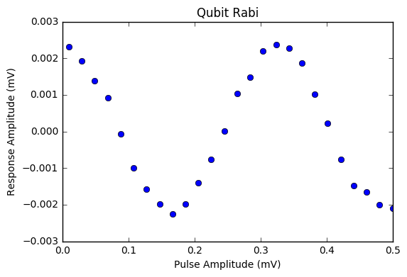
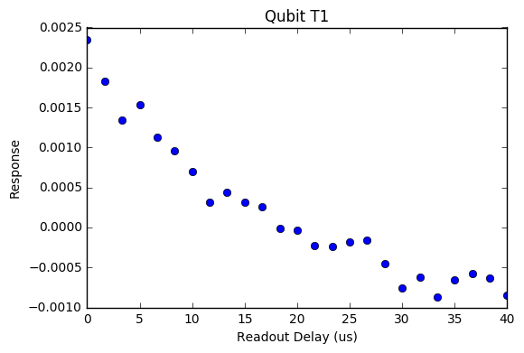
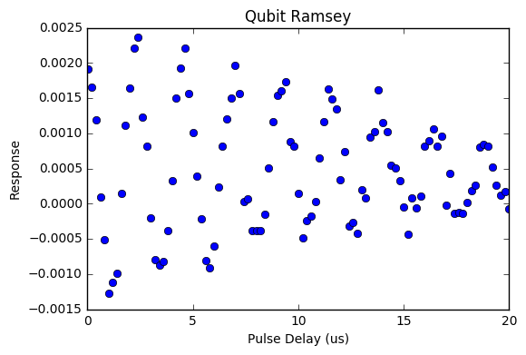
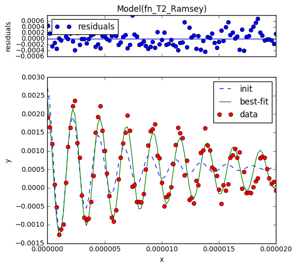

Quantum Processor Unit
======================
pyQuil allows some basic single-qubit experiments to be run on a multi-qubit superconducting quantum
processor.  These three types of experiments are some of the basic building blocks for calibrating
qubits.  This documentation will cover the basics of each experiment, as well as show you how to run
them using pyQuil.

.. note::

    In order to run experiments on the QPU you will need a specially upgraded API key.  If you are
    interested in running these experiments, then email us at support@rigetti.com.

    For QPU plots, please install the lmfit>=0.9.7 package.

Before running any experiments, we need to take a look at what devices are available on the
platform.

::

    from pyquil.qpu import QPUConnection, get_info
    print get_info()

.. parsed-literal::

    {u'devices': [{u'name': u'Z12-13-C4a2',
       u'qubits': [{u'num': 5,
         u'rabi_params': {u'start': 0.01,
          u'step': 0.02,
          u'stop': 0.5,
          u'time': 160.0},
         u'ramsey_params': {u'detuning': 0.5,
          u'start': 0.01,
          u'step': 0.2,
          u'stop': 20},
         u'ssr_fidelity': 0.923,
         u't1': 2e-05,
         u't1_params': {u'num_pts': 25, u'start': 0.01, u'stop': 40},
         u't2': 1.5e-05},
        {u'num': 6,
         u'rabi_params': {u'start': 0.01,
          u'step': 0.02,
          u'stop': 0.5,
          u'time': 100.0},
         u'ramsey_params': {u'detuning': 0.5,
          u'start': 0.01,
          u'step': 0.2,
          u'stop': 20},
         u'ssr_fidelity': 0.923,
         u't1': 2.1e-05,
         u't1_params': {u'num_pts': 30, u'start': 0.01, u'stop': 40},
         u't2': 1.5e-05}]}]}

This JSON provides a list of available devices by their name.  In this example we have one device,
called ``Z12-13-C4a2`` which has two qubits (indexed as qubit numbers 5 and 6) configured and
available for experiments.  This configuration information also returns details about the coherence
times ``t1`` and ``t2`` and the measurement fidelity ``ssr_fidelity`` for each qubit.  It also shows
information about the parameters for each of the experiments on each qubit.

Next we open up a connection to the QPU for the available device.

::

    qpu = QPUConnection("Z12-13-C4a2")
    qpu.ping() # checks to make sure the connection is good

.. parsed-literal::

    'ok'

Rabi Experiments
----------------
A Rabi experiment runs a series of Quil programs.  Each program is parameterized by a rotation
angle:

::

    DEFCIRCUIT RABI(%angle) q:
        RX(%angle) q
        MEASURE q [q]

In our hardware, the angle in the ``RX`` gate is implemented by (roughly) scaling the amplitude of a
micowave pulse.  A larger amplitude corresponds to a larger rotation angle. A Rabi experiment, will
run the RABI program for a series of different amplitudes for the ``RX`` pulse.

Here is how to run a Rabi experiment:

::

    my_qubit = 5
    res = qpu.rabi(my_qubit)
    print type(res), res

.. parsed-literal::

    <class 'pyquil.job_results.RabiResult'> {u'status': u'Submitted', u'jobId': u'BLSLJCBGNP'}

Just like in the JobConnection example for working with the QVM, experiments on a QPU work through
the jobqueue pattern.  When a job is completed, we can use a built in method to plot the results

::

    from pyquil.job_results import wait_for_job
    from pyquil.plots import analog_plot
    wait_for_job(res) # blocks execution until the job is completed
    print res.result
    analog_plot(res)

.. parsed-literal::

    {u'result': u'[[0.01, 0.0296, 0.0492, 0.0688, ... ,
    -0.0007563137318034532, -0.0014812487258596086, -0.0016550719404520116, -0.0020105023806951602,
    -0.0021007405399624955]]', u'jobId': u'LZLQZTAVPK'}

This plot is showing real analog data from an experiment on a superconducting qubit.  The x-axis is
the amplitude of the ``RX`` pulse that is sent to the qubit, in millivolts.  The y-axis is a
response function from a measurement of that qubit that corresponds to the qubits state, as measured
in the computational basis.

Since varying the amplitude of the ``RX`` pulse changes the rotation angle of the qubit around the
x-axis on the Bloch sphere, we can expect to see a periodic change in the state of qubit.  It starts
in the ground state at ``RX(0)`` and then moves to the excited state when ``RX(pi)``.  In this example
we see that an applied pulse amplitude of about 0.18mV corresponds to an ``RX(pi)`` rotation.  This
also tells us that a fitted response of about -0.0024 corresponds to the excited state. In this way
we use experiments like this one, and the others given here, to figure out what physical signals
corresponds to computational operations on our qubits.

T1 Experiments
--------------
T1 experiments measure the t1 coherence time of qubits. A single run of a T1 experiment is an ``X``
gate followed by a wait time, followed by a measurement.  Sweeping this wait time over many runs
gives a T1 experiment.  Since the ``X`` pulse puts the qubit in the excited state, sweeping over the
wait time gives us a sense of how likely a qubit it to remain in the excited state over time. The
likliehood of the qubit staying in the excited state typically decays exponentially, and the decay
constant of this exponent is called the T1 coherence time.

You can run a T1 experiment on our qubits to check their coherence times.

::

    my_qubit = 5
    res_t1 = qpu.t1(my_qubit)
    wait_for_job(res_t1)
    analog_plot(res_t1)

In this exampe we can see an exponential decay of the excited qubit. If we fit this data to an
exponential then we can extract what T1 decay we have measured:

::

    from pyquil.plots import T1DecayModel
    import numpy as np

    model = T1DecayModel()
    x, y = res_t1.decode()

    fit_n_data = model.report_fit(np.asarray(x), np.asarray(y))
    fit, data = (fit_n_data[0], fit_n_data[1:])
    print fit.fit_report()

.. parsed-literal::

    [[Model]]
    Model(fn_T1_decay)
    [[Fit Statistics]]
        # function evals   = 27
        # data points      = 25
        # variables        = 3
        chi-square         = 0.000
        reduced chi-square = 0.000
        Akaike info crit   = -440.113
        Bayesian info crit = -436.456
    [[Variables]]
        baseline:   -0.00106788 +/- 0.000145 (13.56%) (init=-0.0008674491)
        amplitude:   0.00326745 +/- 0.000129 (3.95%) (init= 0.00321364)
        T1:          1.6752e-05 +/- 1.97e-06 (11.76%) (init= 5.33208e-06)
    [[Correlations]] (unreported correlations are <  0.100)
        C(baseline, T1)              = -0.938
        C(baseline, amplitude)       = -0.759
        C(amplitude, T1)             =  0.555

This example showed a T1 of about 16.7 microseconds.

Ramsey Experiments
------------------
Ramsery experiments measure a different kind of decoherence.  While T1 experiments measure the loss
of information along the north-south axis of the Bloch sphere, Ramsey experiments measure the loss
of information around the axis.  This type of decoherence is called dephasing and is captured in the
T2 coherence time of qubits.

A single run of the experiment is a ``X-HALF`` pulse, followed by a wait time, followed by
another ``X-HALF``pulse and a measurement.  Sweeping the wait time over many runs gives a Ramsey
experiment.  The first pulse puts the qubit into a state on the equator of the Bloch sphere.  Waiting
then allows the state to dephase and the second pulse rotates the state back towards the north-south
Bloch sphere axis.  If dephasing has occured, then this will be represented by a decrease in
amplitude in the resulting periodic function.

::

    my_qubit = 5
    ramsey_res = qpu.ramsey(my_qubit)
    wait_for_job(ramsey_res)
    analog_plot(ramsey_res)

If we fit this data to the a decaying periodic function, then we can extract the T2 decay constant.

::

    from pyquil.plots import T2RamseyModel

    model = T2RamseyModel()
    x, y = res_ramsey.decode()
    fit_n_data = model.report_fit(np.asarray(x), np.asarray(y))
    fit, data = (fit_n_data[0], fit_n_data[1:])
    fit.plot()
    plt.show()
    print fit.fit_report()

Note: if you are using a python terminal instead of a notebook, then plot using the following instead:

::

  fig = fit.plot()
  fig[0].show()
  print fit.fit_report()

.. parsed-literal::

    [[Model]]
        Model(fn_T2_Ramsey)
    [[Fit Statistics]]
        # function evals   = 52
        # data points      = 101
        # variables        = 5
        chi-square         = 0.000
        reduced chi-square = 0.000
        Akaike info crit   = -1666.553
        Bayesian info crit = -1653.477
    [[Variables]]
        baseline:    0.00049312 +/- 2.54e-05 (5.16%) (init= 0.0005435569)
        amplitude:   0.00192550 +/- 9.55e-05 (4.96%) (init= 0.002179158)
        T2:          1.4413e-05 +/- 1.35e-06 (9.36%) (init= 5e-06)
        detuning:    4.2761e+05 +/- 1.05e+03 (0.25%) (init= 445767.4)
        x0:         -8.4993e-08 +/- 1.88e-08 (22.16%) (init= 0)
    [[Correlations]] (unreported correlations are <  0.100)
        C(detuning, x0)              =  0.773
        C(amplitude, T2)             = -0.764

From this we can extract that the T2 decoherence for this qubit is about 14.4 microseconds.

pyquil.qpu
----------

.. automodule:: pyquil.qpu
    :members:
    :undoc-members:
    :show-inheritance:
