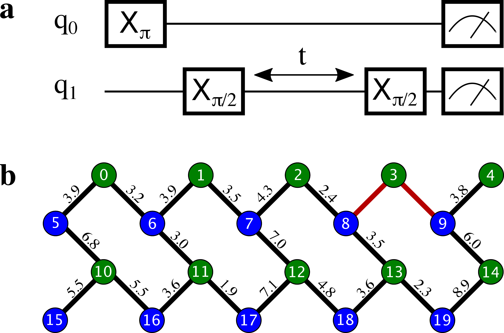

The Rigetti QPU: Technical Overview
===================================

A quantum processor unit (QPU) is a physical device that contains a number of interconnected qubits
which are made available to run quantum algorithms. This page presents technical details and
average performance of the Rigetti QPU device. This device has been designed, fabricated and
packaged at Rigetti Computing.

QPU properties
~~~~~~~~~~~~~~

The quantum processor consists of 20 superconducting transmon qubits with fixed capacitive coupling
in the lattice shown in Fig. 1. The resonance frequency of Qubits 0–4 and 10–14 are flux-tunable
while qubits 5–9 and 15–19 are fixed. The former have two Josephson junctions in an asymmetric
SQUID geometry to provide roughly 1 GHz of frequency tunability, and flux-insensitive “sweet spots”
near

:math:`\omega^{\textrm{max}}_{01}/2\pi\approx 4.5 \, \textrm{GHz}`

and

:math:`\omega^{\textrm{min}}_{01}/2\pi\approx 3.0 \, \textrm{GHz}`.

These tunable devices are coupled to bias lines for AC and DC flux delivery. Each qubit is
capacitively coupled to a quasi-lumped element resonator for dispersive readout of the qubit
state. Single-qubit control is effected by applying microwave drives at the
resonator ports. Two-qubit gates are activated via RF
drives on the flux bias lines.
Due to a fabrication defect, qubit 3
is not tunable, which prohibits operation of the two-qubit
parametric gate described below between qubit 3 and
its neighbors. Consequently, we treat this as a
19-qubit processor.

.. figure:: figures/figure1-1.png
    :width: 540px
    :align: center
    :height: 300px
    :alt: alternate text
    :figclass: align-center

    :math:`\textbf{Figure 1 $|$ Connectivity of Rigetti 19Q. a,}` Chip schematic showing tunable
    transmons (green circles) capacitively coupled to fixed-frequency transmons
    (blue circles). :math:`\textbf{b}`, Optical chip image. Note that some couplers have
    been dropped to produce a lattice with three-fold, rather than four-fold
    connectivity.

.. Rigetti :math:`\textsf{Acorn}` is a quantum device with 20 superconducting qubits,
  designed, fabricated and packaged at Rigetti Computing.
  Figure 1 shows the connectivity of the device:
  qubits 5-9 and 15-19 are fixed-frequency transmon qubits; qubits 0-4
  and 10-14 are tunable transmon qubits. The latter are comprised of a
  SQUID loop (two Josephson junctions in parallel) inductively coupled
  to a bias line for AC and DC flux delivery. The junctions in the SQUID
  loop are asymmetric. This feature provides an energy spectrum with two
  flux-insensitive points at  :math:`\omega^{\textrm{max}}_{01}/2\pi\approx 4.5 \, \textrm{GHz}`
  and :math:`\omega^{\textrm{min}}_{01}/2\pi\approx 3.0 \, \textrm{GHz}`
  where the dephasing rate is significantly reduced. The qubit state is
  inferred from the dispersive shift of a quasi-lumped-element resonator
  capacitively coupled to the qubit. These superconducting microwave
  resonators consist of a :math:`10 \, \mu\textrm{m}` wide meander line
  shunted by a capacitance and their nominal frequency ranges between
  :math:`5.1 - 5.8 \, \textrm{GHz}`. Single-qubit gates are driven through the
  resonators.

.. A quantum mechanical description of Rigetti 19Q is provided by the
  generalized Jaynes-Cummings Hamiltonian, where each transmon qubit is
  capacitively coupled to a resonator and to one or more qubits:
..
  .. math::

     \begin{aligned}
         \hat H = \sum_{i=0}^{19} \left[ \hat{H}^{(i)}_\textrm{r} + \hat{H}^{(i)}_\textrm{q} + \hat{H}^{(i)}_\textrm{r-q} \right] + \sum_{(l,m)\in A}\!\! \hat{H}^{(l,m)}_\textrm{q-q} \label{eq:1}\end{aligned}
.. with:
  .. math::

   \begin{aligned}
          \hat{H}^{(i)}_\textrm{r} &= \hbar \omega^{(i)}_\textrm{r}  \hat{a}_i^\dagger \hat{a}_i\\
          \hat{H}^{(i)}_\textrm{q} &= \hbar\sum_{j}  \omega^{(i)}_j  | j \rangle_{i\,i} \langle j |\\
           \hat{H}^{(i)}_\textrm{r-q} &= \hbar\sum_{jk}  g^{(i)}_{jk} |j \rangle_{i\,i}\langle k|  (\hat{a}_i + \hat{a}_i^\dagger)\\
                \hat{H}^{(l,m)}_\textrm{q-q} &= \hbar\sum_{jk} \lambda_{jk}^{(l,m)}
     \Big[ |j+1 \rangle_{l\,l}\langle j |  + |j \rangle_{l\,l}\langle j + 1 |  \Big]
     \otimes\Big[  |k+1 \rangle_{m\,m}\langle k |  + |k \rangle_{m\,m}\langle k + 1 |  \Big],\end{aligned}

The device is characterized by several parameters:

- :math:`\omega_\textrm{01}/2\pi` is the qubit transition frequency
- :math:`\omega_\textrm{r}/2\pi` is the resonator frequency
- :math:`\eta/2\pi` is the anharmonicity of the qubit
- :math:`g/2\pi` is the coupling strength between a qubit and a resonator
- :math:`\lambda/2\pi` is the coupling strength between two neighboring qubits

In Rigetti 19Q, each tunable qubit is capacitively coupled to one-to-three fixed-frequency qubits. We use a parametric flux modulation to activate a controlled Z
gate between tunable and fixed qubits. The typical time-scale of these entangling gates is in the range
100–250 ns.

.. In Rigetti 19Q, each tunable qubit is capacitively coupled
  to one-to-three fixed-frequency qubits. The DC flux
  biases are set close to zero flux such that each tunable
  qubits is at its maximum frequency :math:`\omega^{\textrm{max}}_\textrm{T}`.
  Two-qubit parametric CZ gates are activated in the
  :math:`|11\rangle \leftrightarrow |20\rangle`
  sub-manifolds by applying an RF flux pulse
  with amplitude :math:`A_0`, frequency :math:`\omega_\textrm{m}` and duration :math:`t_\textrm{CZ}` to the
  tunable qubit. For RF flux modulation about the
  qubit extremal frequency, the oscillation frequency is doubled
  to :math:`2\omega_\textrm{m}` and the mean effective qubit frequency shifts
  to :math:`\bar{\omega}_\textrm{T}`. Note that the frequency shift increases with larger
  flux pulse amplitude. The effective detuning between
  neighboring qubits becomes :math:`\Delta = \bar{\omega}_\textrm{T} - \omega_\textrm{F}`. The resonant
  condition for a CZ gate is achieved when :math:`\Delta = 2\omega_\textrm{m} - \eta_\textrm{T}`
  or :math:`\Delta = 2\omega_\textrm{m} + \eta_\textrm{F}`, where :math:`\eta_\textrm{T}`, :math:`\eta_\textrm{F}` are the anharmonicities
  of the tunable and fixed qubit, respectively. An effective
  rotation angle of :math:`2\pi` on these transitions imparts a minus
  sign to the :math:`|11\rangle` state, implementing an effective CZ gate.
  The time-scale of these entangling gates is in the range
  100–250 ns. Due to finite bandwidth constraints of our
  control electronics, the applied flux pulse is shaped as a
  square pulse with linear rise and fall time of 30 ns.

.. In Rigetti 19Q, each tunable qubit is capacitively coupled to
  one-to-three fixed-frequency qubits. The DC flux biases are set close
  to zero flux such that the frequency of the tunable qubits is at its
  maximum value :math:`f^{\textrm{max}}_\textrm{T}`. Our two qubit gates
  are parametric CZ gates performed in the :math:`11\leftrightarrow 20`
  and/or :math:`11\leftrightarrow 02` sub-manifolds. These entangling
  gates are activated by applying a RF flux pulse (with amplitude
  :math:`A_0`, frequency :math:`f_\textrm{m}` and duration
  :math:`t_\textrm{CZ}`) to the tunable qubits. During the flux pulse,
  the tunable qubit frequency oscillates at :math:`2f_\textrm{m}` and
  the effective qubit frequency shifts down to
  :math:`\bar{f}_\textrm{T}`. The frequency shift depends on the flux
  pulse amplitude. The detuning between the effective qubit frequency
  :math:`\bar{f}_\textrm{T}` and the frequency of the neighboring qubit
  is defined as :math:`\Delta = \bar{f}_\textrm{T} - f_\textrm{F}`. The
  resonant condition for a CZ gate is achieved when the detuning is
  equal to :math:`\Delta = 2 f_\textrm{m} - \eta_\textrm{T}` or
  :math:`\Delta = 2 f_\textrm{m} + \eta_\textrm{F}`, where
  :math:`\eta_\textrm{T}`, :math:`\eta_\textrm{F}` are the
  anharmonicities of the tunable and fixed qubit, respectively. The
  time-scale of these entangling gates is in the range
  :math:`100-250 \, \textrm{ns}`.

.. This device is fabricated on a high-resistivity silicon substrate with
  through-silicon via technology to improve
  isolation and prevent chip resonances from interfering with qubit and
  resonator modes. The superconducting components are patterned on top
  of the silicon substrate with standard lithographic tech- niques. The
  circuitry is made of aluminum with critical temperature of $T_\textrm{c} \approx 1.2\,\textrm{K}$.
  The nominal thickness of the aluminum layer is 100 nm. The Josephson
  junctions are fabricated with double-angle evaporation bridge-free
  techniques.

Table 1 summarizes the main performance
parameters of Rigetti 19Q. The resonator and qubit frequencies are
measured with standard spectroscopic techniques. The relaxation time
:math:`T_1` is extracted from repeated inversion recovery experiments.
Similarly, the coherence time :math:`T^*_2` is measured with repeated
Ramsey fringe experiments. Single-qubit gate fidelities are estimated
with randomized benchmarking protocols in which a sequence of
:math:`m` Clifford gates is applied to the qubit followed by a
measurement on the computational basis. The sequence of Clifford gates
are such that the first :math:`m-1` gates are chosen uniformly at
random from the Clifford group, while the last Clifford gate is chosen
to bring the state of the system back to the initial state. This
protocol is repeated for different values of
:math:`m\in \{2,4,8,16,32,64,128\}`. The reported single-qubit gate
fidelity is related to the randomized benchmarking decay constant
:math:`p` in the following way:
:math:`\mathsf{F}_\textrm{1q} = p +(1-p)/2`. Finally, the readout
assignment fidelities are extracted with dispersive readouts combined
with a linear classifier trained on :math:`|0\rangle` and
:math:`|1\rangle` state preparation for each qubit. The reported
readout assignment fidelity is given by expression
:math:`\mathsf{F}_\textrm{RO} = [p(0|0)+p(1|1)]/2`, where
:math:`p(b|a)` is the probability of measuring the qubit in state
:math:`b` when prepared in state :math:`a`.

.. csv-table:: :math:`\textbf{Table 1 | Rigetti 19Q performance}`
   :widths: 10, 10, 10, 10, 10, 10, 10, 10
   :stub-columns: 1

   ,:math:`\omega^{\textrm{max}}_{\textrm{r}}/2\pi`,:math:`\omega^{\textrm{max}}_{01}/2\pi`,:math:`\eta/2\pi`,:math:`T_1`,:math:`T^*_2`,:math:`\mathsf{F}_{\textrm{1q}}`,:math:`\mathsf{F}_{\textrm{RO}}`
   ,:math:`\textrm{MHz}`,:math:`\textrm{MHz}`,:math:`\textrm{MHz}`,:math:`\mu\textrm{s}`,:math:`\mu\textrm{s}`,,
   0 ,5592,4386,-208,**15.2** :math:`\pm` 2.5,**7.2** :math:`\pm` 0.7,0.9815,0.938
   1 ,5703,4292,-210,**17.6** :math:`\pm` 1.7,**7.7** :math:`\pm` 1.4,0.9907,0.958
   2 ,5599,4221,-142,**18.2** :math:`\pm` 1.1,**10.8** :math:`\pm` 0.6,0.9813,0.97
   3 ,5708,3829,-224,**31.0** :math:`\pm` 2.6,**16.8** :math:`\pm` 0.8,0.9908,0.886
   4 ,5633,4372,-220,**23.0** :math:`\pm` 0.5,**5.2** :math:`\pm` 0.2,0.9887,0.953
   5 ,5178,3690,-224,**22.2** :math:`\pm` 2.1,**11.1** :math:`\pm` 1.0,0.9645,0.965
   6 ,5356,3809,-208,**26.8** :math:`\pm` 2.5,**26.8** :math:`\pm` 2.5,0.9905,0.84
   7 ,5164,3531,-216,**29.4** :math:`\pm` 3.8,**13.0** :math:`\pm` 1.2,0.9916,0.925
   8 ,5367,3707,-208,**24.5** :math:`\pm` 2.8,**13.8** :math:`\pm` 0.4,0.9869,0.947
   9 ,5201,3690,-214,**20.8** :math:`\pm` 6.2,**11.1** :math:`\pm` 0.7,0.9934,0.927
   10,5801,4595,-194,**17.1** :math:`\pm` 1.2,**10.6** :math:`\pm` 0.5,0.9916,0.942
   11,5511,4275,-204,**16.9** :math:`\pm` 2.0,**4.9** :math:`\pm` 1.0,0.9901,0.900
   12,5825,4600,-194,**8.2**  :math:`\pm` 0.9,**10.9** :math:`\pm` 1.4,0.9902,0.942
   13,5523,4434,-196,**18.7** :math:`\pm` 2.0,**12.7** :math:`\pm` 0.4,0.9933,0.921
   14,5848,4552,-204,**13.9** :math:`\pm` 2.2,**9.4** :math:`\pm` 0.7,0.9916,0.947
   15,5093,3733,-230,**20.8** :math:`\pm` 3.1,**7.3** :math:`\pm` 0.4,0.9852,0.970
   16,5298,3854,-218,**16.7** :math:`\pm` 1.2,**7.5** :math:`\pm` 0.5,0.9906,0.948
   17,5097,3574,-226,**24.0** :math:`\pm` 4.2,**8.4** :math:`\pm` 0.4,0.9895,0.921
   18,5301,3877,-216,**16.9** :math:`\pm` 2.9,**12.9** :math:`\pm` 1.3,0.9496,0.930
   19,5108,3574,-228,**24.7** :math:`\pm` 2.8,**9.8** :math:`\pm` 0.8,0.9942,0.930

The coupling strength between two qubits can be extracted from a
precise measurement of the qubit frequency shift when the neighboring
qubit is in the excited state. This protocol consists of two steps: a
:math:`\pi` is applied to the first qubit, followed by a Ramsey fringe
experiment on the second qubit which precisely determines its
transition frequency (see Fig. 3a). The effective shift is denoted by
:math:`\chi_\textrm{qq}` and typical values are in the range
:math:`\approx 100 \, \textrm{kHz}`. The coupling strength :math:`\lambda` between the two qubits
can be calculated in the following way:

  .. math::

     \lambda^{(1,2)} = \sqrt{\left|\frac{\chi^{(1,2)}_\textrm{qq} \left[\,f^\textrm{(1)}_{01}-f^\textrm{(2)}_{12}\right]\left[\,f^\textrm{(1)}_{12}-f^\textrm{(2)}_{01}\right]}{2(\eta_1+\eta_2)}\right|}

Figure 3b shows the coupling strength for our device. This quantity is crucial to predict the gate time
of our parametric entangling gates.

    :math:`\textbf{Figure 3 $|$ Coupling strength. a,}` Quantum circuit
    implemented to measure the qubit-qubit effective frequency shift.
    :math:`\textbf{b,}` Capacitive coupling between neighboring qubits expressed in MHz.

..   Table 2 shows the two-qubit gate performance
    of Rigetti 19Q. These parameters refer to parametric CZ gates
    performed on one pair at a time. The flux pulse that activates these
    entangling gates is a square pulse with linear rise time and fall down
    time of :math:`30 \, \textrm{ns}`. The amplitude of the flux pulse
    :math:`A_0` is expressed in terms of flux quanta. When
    :math:`A_0 = 1 \, \Phi_0`, the qubit performs complete
    oscillations between maximum sweet spots. The parameter
    :math:`f_\textrm{m}` is the modulation frequency of the applied flux
    pulse and its optimal value is estimated by fitting a vertical slice
    of a two-qubit chevron interaction with a sinc function model. The
    gate time is calibrated by fitting sinusoidal oscillations of coherent
    population exchange between the
    :math:`|20\rangle \leftrightarrow |11\rangle` states.

Table 2 shows the two-qubit gate performance
of Rigetti 19Q. These parameters refer to parametric CZ gates
performed on one pair at a time. We
analyze these CZ gates through quantum process tomography (QPT). This
procedure starts by applying local rotations to the two qubits taken
from the set :math:`\{\mathbb{I},R_x(\pi/2),R_y(\pi/2),R_x(\pi)\}`,
followed by a CZ gate and post-rotations that bring the qubit states
back to the computational basis. QPT involves the analysis of
:math:`16\times16 =256` different experiments, each of which we repeat
:math:`500` times. The reported process tomography fidelity
:math:`\mathsf{F}^\textrm{cptp}_\textrm{PT}` indicates the fidelity
between the ideal process and the measured process imposing complete
positivity (cp) and trace preservation (tp) constraints. The quantity
:math:`\mathsf{F}_\textrm{PT}` instead is extracted without cptp
constraints on the estimated map.

.. The fidelities reported in
   Table 2 are averaged values from four
   tomography experiments.

.. csv-table:: :math:`\textbf{Table 2 | Rigetti 19Q two-qubit gate performance}`
   :widths: 10, 10, 10, 10, 10, 10
   :stub-columns: 1

   ,:math:`A_0`,:math:`f_\textrm{m}`,:math:`t_\textrm{CZ}`,:math:`\mathsf{F}^\textrm{cptp}_{\textrm{PT}}`,:math:`\mathsf{F}_{\textrm{PT}}`
   ,:math:`\Phi/\Phi_0`,:math:`\textrm{MHz}`,ns
   0 - 5 ,0.27,94.5,168,0.936,0.966
   0 - 6 ,0.36,123.9,197,0.889,0.900
   1 - 6 ,0.37,137.1,173,0.888,0.948
   1 - 7 ,0.59,137.9,179,0.919,0.974
   2 - 7 ,0.62,87.4,160,0.817,0.860
   2 - 8, 0.23,55.6,189,0.906,0.918
   4 - 9, 0.43,183.6,122,0.854,0.876
   5 - 10,0.60,152.9,145,0.870,0.902
   6 - 11 ,0.38,142.4,180,0.838,0.927
   7 - 12 ,0.60,241.9,214,0.87,0.890
   8 - 13,0.40,152.0,185,0.881,0.895
   9 - 14,0.62,130.8,139,0.872,0.937
   10 - 15,0.53,142.1,154,0.854,0.875
   10 - 16,0.43,170.3,180,0.838,0.847
   11 - 16,0.38,160.6,155,0.891,0.903
   11 - 17,0.29,85.7,207,0.844,0.875
   12 - 17,0.36,177.1,184,0.876,0.908
   12 - 18,0.28,113.9,203,0.886,0.923
   13 - 18,0.24,66.2,152,0.936,0.975
   13 - 19,0.62,109.6,181,0.921,0.941
   14 - 19,0.59,188.1,142,0.797,0.906

The interested user can have access to this quantum machine by submitting a request on :math:`\textsf{rigetti.com}`.
Single-qubit and two-qubit gates are retuned every hour. The retuning approximately takes 10 minutes to complete.
After retuning, the user can submit new jobs to the quantum machine.
