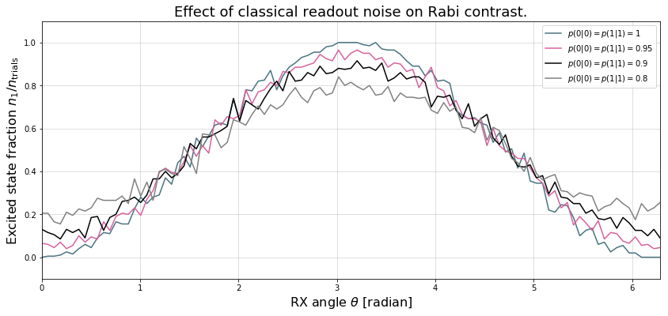

Readout noise
=============

Theoretical Overview
--------------------

Qubit-Readout can be corrupted in a variety of ways. The two most
relevant error mechanisms on the Rigetti QPU right now are:

1. Transmission line noise that makes a 0-state look like a 1-state or
   vice versa. We call this **classical readout bit-flip error**. This
   type of readout noise can be reduced by tailoring optimal readout
   pulses and using superconducting, quantum limited amplifiers to
   amplify the readout signal before it is corrupted by classical noise
   at the higher temperature stages of our cryostats.
2. T1 qubit decay during readout (our readout operations can take more
   than a µsecond unless they have been specially optimized), which
   leads to readout signals that initially behave like 1-states but then
   collapse to something resembling a 0-state. We will call this
   **T1-readout error**. This type of readout error can be reduced by
   achieving shorter readout pulses relative to the T1 time, i.e., one
   can try to reduce both the readout pulse length, or increase the T1
   time or both.

Qubit measurements
------------------

This section provides the necessary theoretical foundation for
accurately modeling noisy quantum measurements on superconducting
quantum processors. It relies on some of the abstractions (density
matrices, Kraus maps) introduced in our notebook on `gate noise
models <GateNoiseModels.ipynb>`__.

The most general type of measurement performed on a single qubit at a
single time can be characterized by some set :math:`\mathcal{O}` of
measurement outcomes, e.g., in the simplest case
:math:`\mathcal{O} = \{0, 1\}`, and some unnormalized quantum channels
(see notebook on gate noise models) that encapsulate 1. the probability
of that outcome 2. how the qubit state is affected conditional on the
measurement outcome.

Here the *outcome* is understood as classical information that has been
extracted from the quantum system.

Projective, ideal measurement
~~~~~~~~~~~~~~~~~~~~~~~~~~~~~

The simplest case that is usually taught in introductory quantum
mechanics and quantum information courses are Born's rule and the
projection postulate which state that there exist a complete set of
orthogonal projection operators

.. math::

   P_{\mathcal{O}} := \{\Pi_x \text{ Projector }\mid x \in \mathcal{O}\},

i.e., one for each measurement outcome. Any projection operator must
satisfy :math:`\Pi_x^\dagger = \Pi_x = \Pi_x^2` and for an *orthogonal*
set of projectors any two members satisfy

.. math::

   \Pi_x\Pi_y = \delta_{xy} \Pi_x = \begin{cases} 0 & \text{ if } x \ne y \\ \Pi_x & \text{ if } x = y \end{cases}

and for a *complete* set we additionally demand that
:math:`\sum_{x\in\mathcal{O}} \Pi_x = 1`. Following our introduction to
gate noise, we write quantum states as density matrices as this is more
general and in closer correspondence with classical probability theory.

With these the probability of outcome :math:`x` is given by
:math:`p(x) = \tr{\Pi_x \rho \Pi_x} = \tr{\Pi_x^2 \rho} = \tr{\Pi_x \rho}`
and the post measurement state is

.. math::

   \rho_x = \frac{1}{p(x)} \Pi_x \rho \Pi_x,

which is the projection postulate applied to mixed states.

If we were a sloppy quantum programmer and accidentally erased the
measurement outcome then our best guess for the post measurement state
would be given by something that looks an awful lot like a Kraus map:

.. math::

   \rho_{\text{post measurement}} = \sum_{x\in\mathcal{O}} p(x) \rho_x = \sum_{x\in\mathcal{O}} \Pi_x \rho \Pi_x.

The completeness of the projector set ensures that the trace of the
post measurement is still 1 and the Kraus map form of this expression
ensures that :math:`\rho_{\text{post measurement}}` is a positive
(semi-)definite operator.

Classical readout bit-flip error
~~~~~~~~~~~~~~~~~~~~~~~~~~~~~~~~

Consider now the ideal measurement as above, but where the outcome
:math:`x` is transmitted across a noisy classical channel that produces
a final outcome :math:`x'\in \mathcal{O}' = \{0', 1'\}` according to
some conditional probabilities :math:`p(x'|x)` that can be recorded in
the *assignment probability matrix*

.. math::

   P_{x'|x} = \begin{pmatrix}
   p(0 | 0) & p(0 | 1) \\
   p(1 | 0) & p(1 | 1)
   \end{pmatrix}

Note that this matrix has only two independent parameters as each
column must be a valid probability distribution, i.e. all elements are
non-negative and each column sums to 1.

This matrix allows us to obtain the probabilities
:math:`\mathbf{p}' := (p(x'=0), p(x'=1))^T` from the original outcome
probabilities :math:`\mathbf{p} := (p(x=0), p(x=1))^T` via
:math:`\mathbf{p}' = P_{x'|x}\mathbf{p}`. The difference relative to the
ideal case above is that now an outcome :math:`x' = 0` does not
necessarily imply that the post measurement state is truly
:math:`\Pi_{0} \rho \Pi_{0} / p(x=0)`. Instead, the post measurement
state given a noisy outcome :math:`x'` must be

.. raw:: latex

   \begin{align}
   \rho_{x'} & = \sum_{x\in \mathcal{O}} p(x|x') \rho_x \\
             & = \sum_{x\in \mathcal{O}} p(x'|x)\frac{p(x)}{p(x')} \rho_x \\
             & = \frac{1}{p(x')}\sum_{x\in \mathcal{O}} p(x'|x) \Pi_x \rho \Pi_x
   \end{align}

where

.. raw:: latex

   \begin{align}
   p(x') & = \sum_{x\in\mathcal{O}} p(x'|x) p(x)  \\
   & = \tr{\sum_{x\in \mathcal{O}} p(x'|x) \Pi_x \rho \Pi_x} \\
   & = \tr{\rho \sum_{x\in \mathcal{O}} p(x'|x)\Pi_x} \\
   & = \tr{\rho E_x'}.
   \end{align}

where we have exploited the cyclical property of the trace
:math:`\tr{ABC}=\tr{CBA}` and the projection property
:math:`\Pi_x^2 = \Pi_x`. This has allowed us to derive the noisy outcome
probabilities from a set of positive operators

.. math::

   E_{x'} := \sum_{x\in \mathcal{O}} p(x'|x)\Pi_x \ge 0

that must sum to 1:

.. math::

   \sum_{x'\in\mathcal{O}'} E_x' = \sum_{x\in\mathcal{O}}\underbrace{\left[\sum_{x'\in\mathcal{O}'} p(x'|x)\right]}_{1}\Pi_x = \sum_{x\in\mathcal{O}}\Pi_x = 1.

The above result is a type of generalized **Bayes' theorem** that is
extremely useful for this type of (slightly) generalized measurement and
the family of operators :math:`\{E_{x'}| x' \in \mathcal{O}'\}` whose
expectations give the probabilities is called a **positive operator
valued measure** (POVM). These operators are not generally orthogonal
nor valid projection operators but they naturally arise in this
scenario. This is not yet the most general type of measurement, but it
will get us pretty far.

How to model :math:`T_1` error
~~~~~~~~~~~~~~~~~~~~~~~~~~~~~~

T1 type errors fall outside our framework so far as they involve a
scenario in which the *quantum state itself* is corrupted during the
measurement process in a way that potentially erases the pre-measurement
information as opposed to a loss of purely classical information. The
most appropriate framework for describing this is given by that of
measurement instruments, but for the practical purpose of arriving at a
relatively simple description, we propose describing this by a T1
damping Kraus map followed by the noisy readout process as described
above.

Further reading
~~~~~~~~~~~~~~~

Chapter 3 of John Preskill's lecture notes
http://www.theory.caltech.edu/people/preskill/ph229/notes/chap3.pdf

How do I get started?
---------------------

1. Come up with a good guess for your readout noise parameters
   :math:`p(0|0)` and :math:`p(1|1)`, the off-diagonals then follow from
   the normalization of :math:`P_{x'|x}`. If your assignment fidelity
   :math:`F` is given, and you assume that the classical bit flip noise
   is roughly symmetric, then a good approximation is to set
   :math:`p(0|0)=p(1|1)=F`.
2. For your QUIL program ``p``, and a qubit index ``q`` call:

   ::

       p.define_noisy_readout(q, p00, p11)

   where you should replace ``p00`` and ``p11`` with the assumed
   probabilities.

Estimate :math:`P_{x'|x}` yourself!
~~~~~~~~~~~~~~~~~~~~~~~~~~~~~~~~~~~

You can also run some simple experiments to estimate the assignment
probability matrix directly from a QPU.

**Scroll down for some examples!**

.. code:: python

    from __future__ import print_function, division
    import numpy as np
    import matplotlib.pyplot as plt
    %matplotlib inline

.. code:: python

    from pyquil.quil import Program, MEASURE, Pragma
    from pyquil.api.qvm import QVMConnection
    from pyquil.gates import I, X, RX

.. code:: python

    DARK_TEAL = '#48737F'
    FUSCHIA = '#D6619E'
    BEIGE = '#EAE8C6'

.. code:: python

    cxn = QVMConnection()

Example 1: Rabi sequence with noisy readout
-------------------------------------------

.. code:: python

    %%time

    # number of angles
    num_theta = 101

    # number of program executions
    trials = 200

    thetas = np.linspace(0, 2*np.pi, num_theta)

    p00s = [1., 0.95, 0.9, 0.8]

    results = np.zeros((num_theta, len(p00s)))

    for jj, theta in enumerate(thetas):
        for kk, p00 in enumerate(p00s):
            cxn.random_seed = hash((jj, kk))
            p = Program(RX(theta)(0))
            # assume symmetric noise p11 = p00
            p.define_noisy_readout(0, p00, p00)
            p.measure(0, 0)
            res = cxn.run(p, [0], trials=trials)
            results[jj, kk] = np.sum(res)

.. parsed-literal::

    CPU times: user 1.25 s, sys: 77.2 ms, total: 1.32 s
    Wall time: 3.97 s

.. code:: python

    plt.figure(figsize=(14, 6))
    for jj, (p00, c) in enumerate(zip(p00s, [DARK_TEAL, FUSCHIA, "k", "gray"])):
        plt.plot(thetas, results[:, jj]/trials, c=c, label=r"$p(0|0)=p(1|1)={:g}$".format(p00))
    plt.legend(loc="best")
    plt.xlim(*thetas[[0,-1]])
    plt.ylim(-.1, 1.1)
    plt.grid(alpha=.5)
    plt.xlabel(r"RX angle $\theta$ [radian]", size=16)
    plt.ylabel(r"Excited state fraction $n_1/n_{\rm trials}$", size=16)
    plt.title("Effect of classical readout noise on Rabi contrast.", size=18)

Example 2: Estimate the assignment probabilities
------------------------------------------------

The following code is actually borrowed from
`grove <https://github.com/rigetticomputing/grove/blob/f9747211b34592db72b2e80f6f27624ca5c7becd/grove/tomography/utils.py#L346>`__

.. code:: python

    def estimate_assignment_progs(q, trials, cxn, p0=Program()):
        """
        Return a pair of quantum programs that allows estimating the readout
        assignment probabilities for a given qubit ``q``

        :param int q: The index of the qubit
        :return: A pair of programs I(q), X(q) to sample
        """

        results_I = np.sum(cxn.run(p0 + Program(I(q), MEASURE(q, 0)), [0], trials))
        results_X = np.sum(cxn.run(p0 + Program(X(q), MEASURE(q, 0)), [0], trials))

        p00 = 1. - results_I / trials
        p11 = results_X / trials
        return np.array([[p00, 1 - p11],
                         [1 - p00, p11]])

Estimate assignment probabilities for a perfect quantum computer
~~~~~~~~~~~~~~~~~~~~~~~~~~~~~~~~~~~~~~~~~~~~~~~~~~~~~~~~~~~~~~~~

.. code:: python

    estimate_assignment_progs(0, 1000, cxn, Program())

.. parsed-literal::

    array([[ 1.,  0.],
           [ 0.,  1.]])

Re-Estimate assignment probabilities for an imperfect quantum computer
~~~~~~~~~~~~~~~~~~~~~~~~~~~~~~~~~~~~~~~~~~~~~~~~~~~~~~~~~~~~~~~~~~~~~~

.. code:: python

    estimate_assignment_progs(0, 10000, cxn, Program().define_noisy_readout(0, .8, .9))

.. parsed-literal::

    array([[ 0.8042,  0.0989],
           [ 0.1958,  0.9011]])

